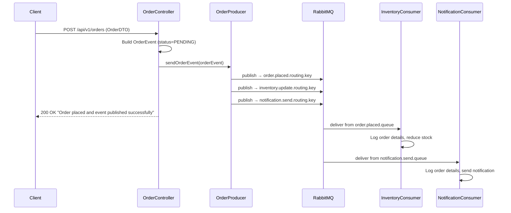
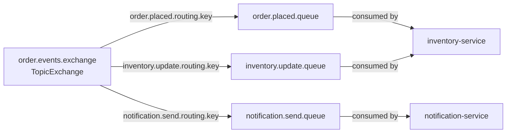

# Architecture & Flow — Event-Driven Microservices

A detailed guide to understand the design, message flow, and RabbitMQ topology of this project.

---

## Part 1 — RabbitMQ Core Concepts (Theory First)

Before looking at the code, understand these 4 building blocks. Every RabbitMQ integration is just a combination of these.

---

### 1. Queue

A **Queue** is a buffer that stores messages until a consumer picks them up.

- Messages sit in the queue in order (FIFO)
- A queue is **durable** (survives RabbitMQ restart) or **transient** (lost on restart)
- Only **one consumer** processes each message (point-to-point)

```
Producer → [  msg1  msg2  msg3  ] Queue → Consumer
```

**In Spring Boot:**
```java
@Bean
public Queue orderQueue() {
    return new Queue("order.placed.queue"); // durable by default
}
```

---

### 2. Exchange

A **Exchange** receives messages from producers and routes them to queues. The producer **never sends directly to a queue** — it always sends to an exchange.

There are 4 types:

| Type | How it routes |
|------|--------------|
| **Direct** | Exact match on routing key |
| **Topic** | Pattern match on routing key (`*` = one word, `#` = zero or more) |
| **Fanout** | Ignores routing key — sends to ALL bound queues |
| **Headers** | Routes by message headers, not routing key |

> This project uses **TopicExchange** — flexible and industry standard.

**In Spring Boot:**
```java
@Bean
public TopicExchange orderExchange() {
    return new TopicExchange("order.events.exchange");
}
```

---

### 3. Routing Key

A **Routing Key** is a string label the producer attaches to the message when sending to the exchange. The exchange uses it to decide which queue(s) get the message.

Think of it like a **postal code** — the exchange is the post office that reads it and decides where to deliver.

```
Producer → Exchange (reads routing key) → correct Queue
```

Examples used in this project:
```
order.placed.routing.key       → routes to order.placed.queue
inventory.update.routing.key   → routes to inventory.update.queue
notification.send.routing.key  → routes to notification.send.queue
```

---

### 4. Binding

A **Binding** is the link between an exchange and a queue. It says:
> "When a message with THIS routing key arrives at THIS exchange, send it to THIS queue."

Without a binding, the exchange doesn't know which queues exist.

```
Exchange ──[binding: routing key]──▶ Queue
```

**In Spring Boot:**
```java
@Bean
public Binding orderQueueBinding() {
    return BindingBuilder
        .bind(orderQueue())          // which queue
        .to(orderExchange())         // to which exchange
        .with(orderPlacedRoutingKey); // when routing key matches
}
```

---

### How It All Connects

```
                    ┌─────────────────────────────────┐
Producer            │         EXCHANGE                 │
sends message  ───▶ │   (reads the routing key)        │
with routing key    │                                  │
                    └──────┬──────────────┬────────────┘
                           │              │
                    [binding A]      [binding B]
                     routing key      routing key
                           │              │
                    ┌──────▼───┐   ┌──────▼──────┐
                    │  Queue A │   │   Queue B   │
                    └──────────┘   └─────────────┘
                         │                │
                    Consumer A       Consumer B
```

---

### Step-by-Step: How to Configure in Each Service

#### Step 1 — Define the Exchange (order-service only — producer declares it)
```java
@Bean
public TopicExchange orderExchange() {
    return new TopicExchange("order.events.exchange");
}
```

#### Step 2 — Define Queues (one per consumer service)
```java
@Bean
public Queue orderQueue() {
    return new Queue("order.placed.queue");
}

@Bean
public Queue inventoryQueue() {
    return new Queue("inventory.update.queue");
}

@Bean
public Queue notificationQueue() {
    return new Queue("notification.send.queue");
}
```

#### Step 3 — Bind Each Queue to the Exchange with a Routing Key
```java
@Bean
public Binding orderQueueBinding() {
    return BindingBuilder.bind(orderQueue())
        .to(orderExchange())
        .with("order.placed.routing.key");
}

@Bean
public Binding inventoryQueueBinding() {
    return BindingBuilder.bind(inventoryQueue())
        .to(orderExchange())
        .with("inventory.update.routing.key");
}

@Bean
public Binding notificationQueueBinding() {
    return BindingBuilder.bind(notificationQueue())
        .to(orderExchange())
        .with("notification.send.routing.key");
}
```

#### Step 4 — Configure Message Converter (JSON support)
```java
@Bean
public MessageConverter jacksonMessageConverter() {
    return new JacksonJsonMessageConverter(); // Java object ↔ JSON
}
```

#### Step 5 — Configure RabbitTemplate (producer only)
```java
@Bean
public AmqpTemplate amqpTemplate(ConnectionFactory connectionFactory) {
    RabbitTemplate rabbitTemplate = new RabbitTemplate(connectionFactory);
    rabbitTemplate.setMessageConverter(jacksonMessageConverter());
    return rabbitTemplate;
}
```

#### Step 6 — Force Declaration on Startup (producer only)
Without this, queues only appear in RabbitMQ after a consumer connects.
```java
@Bean
public RabbitAdmin rabbitAdmin(ConnectionFactory connectionFactory) {
    return new RabbitAdmin(connectionFactory);
}

@Bean
public ApplicationRunner rabbitInitializer(RabbitAdmin rabbitAdmin) {
    return args -> rabbitAdmin.initialize(); // declares all beans on startup
}
```

#### Step 7 — Publish a Message (producer)
```java
amqpTemplate.convertAndSend(exchangeName, routingKey, orderEvent);
// exchange routes the message to the correct queue based on routing key
```

#### Step 8 — Consume a Message (consumer service)
```java
@RabbitListener(queues = "${rabbitmq.queue.notification.name}")
public void consumeOrderEvent(OrderEvent orderEvent) {
    // Spring automatically deserializes the JSON back to OrderEvent object
}
```

---

### Consumer Service Configuration (Minimal)

Consumer services only need the **message converter** — they don't declare the exchange or bindings (the producer owns that):

```java
@Configuration
public class RabbitMQConfig {

    @Bean
    public MessageConverter jacksonMessageConverter() {
        return new JacksonJsonMessageConverter();
    }

    @Bean
    public SimpleRabbitListenerContainerFactory rabbitListenerContainerFactory(
            ConnectionFactory connectionFactory) {
        SimpleRabbitListenerContainerFactory factory = new SimpleRabbitListenerContainerFactory();
        factory.setConnectionFactory(connectionFactory);
        factory.setMessageConverter(jacksonMessageConverter());
        return factory;
    }
}
```

---

### 5. Message Properties

Every message in RabbitMQ carries **metadata** alongside the body. These are called **Message Properties** and they travel with every message automatically.

| Property | Type | Description |
|----------|------|-------------|
| `content-type` | String | Format of the body (e.g. `application/json`) |
| `delivery-mode` | int | `1` = transient (memory only), `2` = persistent (disk) |
| `correlation-id` | String | Links request to reply in RPC pattern |
| `reply-to` | String | Queue name the server should send response to |
| `expiration` | String | Per-message TTL in milliseconds (as a string) |
| `message-id` | String | Unique message identifier set by the producer |
| `timestamp` | Date | When the message was sent |
| `headers` | Map | Custom key-value metadata you add |
| `priority` | Integer | Message priority (0–9) |
| `routing-key` | String | The routing key used when message was published |

**In Spring AMQP:**
```java
// Reading properties in a listener
@RabbitListener(queues = "order.placed.queue")
public void consume(OrderEvent event, @Header(AmqpHeaders.CONTENT_TYPE) String contentType,
        @Header(AmqpHeaders.MESSAGE_ID) String messageId) {
    log.info("Content-Type: {}, Message-ID: {}", contentType, messageId);
}

// Setting properties when publishing
MessagePostProcessor props = message -> {
    message.getMessageProperties().setMessageId(UUID.randomUUID().toString());
    message.getMessageProperties().setContentType("application/json");
    message.getMessageProperties().setDeliveryMode(MessageDeliveryMode.PERSISTENT);
    return message;
};
amqpTemplate.convertAndSend(exchange, routingKey, orderEvent, props);
```

---

### 6. Connection vs Channel — Why Two Levels?

Understanding why RabbitMQ uses two layers helps you configure Spring AMQP correctly.

```
Application
    │
    └── TCP Connection (expensive to open — 1 per app)
            │
            ├── Channel 1  (lightweight — thread A's operations)
            ├── Channel 2  (lightweight — thread B's operations)
            └── Channel N  (lightweight — thread N's operations)
```

**Why not one connection per operation?**
Opening a TCP connection takes 3-way handshake + TLS negotiation — ~100ms. Channels open in microseconds inside an existing connection.

**Spring AMQP `CachingConnectionFactory`** manages this automatically:
- Maintains one TCP connection (by default)
- Pools channels for reuse — checks them out for each operation, returns them after
- You never manage connections/channels manually in Spring Boot

---

## Part 2 — System Architecture & Flow

## Overview

When a client places an order, the **order-service** publishes an event to a RabbitMQ **TopicExchange**. The exchange routes the event to multiple queues based on routing keys. Each consumer service (inventory-service, notification-service) independently picks up the event from its own queue and processes it — with no knowledge of each other.

This is the **Publisher/Subscriber** pattern via a **Message Broker**.

---

## System Architecture

```
┌─────────────────────────────────────────────────────────────────────────┐
│                          CLIENT (Postman / Frontend)                     │
│                     POST /api/v1/orders  {orderId, name, qty, price}     │
└───────────────────────────────────┬─────────────────────────────────────┘
                                    │ HTTP
                                    ▼
┌───────────────────────────────────────────────────────────────────────────┐
│                         ORDER-SERVICE  (port 8081)                        │
│                                                                           │
│   OrderController  →  builds OrderEvent (status=PENDING)                 │
│          │                                                                │
│          ▼                                                                │
│   OrderProducer    →  publishes to RabbitMQ Exchange                     │
└───────────────────────────────┬───────────────────────────────────────────┘
                                │
                                ▼
┌───────────────────────────────────────────────────────────────────────────┐
│                  RABBITMQ  —  order.events.exchange (TopicExchange)        │
│                                                                           │
│   Routing Key: order.placed.routing.key   →  order.placed.queue          │
│   Routing Key: inventory.update.routing.key → inventory.update.queue     │
│   Routing Key: notification.send.routing.key → notification.send.queue   │
└────────────────────┬───────────────────────────┬──────────────────────────┘
                     │                           │
          ┌──────────▼──────────┐     ┌──────────▼──────────────┐
          │  INVENTORY-SERVICE  │     │  NOTIFICATION-SERVICE    │
          │    (port 8082)      │     │      (port 8083)         │
          │                     │     │                          │
          │  Listens to:        │     │  Listens to:             │
          │  order.placed.queue │     │  notification.send.queue │
          │                     │     │                          │
          │  → Reduces stock    │     │  → Sends confirmation    │
          └─────────────────────┘     └──────────────────────────┘
```

---

## Message Flow (Step by Step)



---

## RabbitMQ Topology



---

## OrderEvent Payload

This is the message published to RabbitMQ as JSON:

```json
{
  "status": "PENDING",
  "message": "Order placed successfully",
  "order": {
    "orderId": "ORD-001",
    "name": "iPhone 15",
    "quantity": 2,
    "price": 999.99
  }
}
```

> **Note:** The client only sends `order` fields. `status` and `message` are set by order-service internally.

---

## Service Responsibilities

### order-service (Producer)
| Component | Responsibility |
|-----------|---------------|
| `OrderController` | Receives HTTP request, validates input, builds `OrderEvent` |
| `OrderProducer` | Publishes `OrderEvent` to all 3 routing keys on the exchange |
| `RabbitMQConfig` | Declares exchange, queues, bindings, message converter, RabbitAdmin |
| `OrderDTO` | Input from client — validated with `@NotBlank`, `@Min`, `@Positive` |
| `OrderEvent` | Wrapper with `status`, `message`, and the `OrderDTO` |

### inventory-service (Consumer)
| Component | Responsibility |
|-----------|---------------|
| `InventoryConsumer` | Listens to `order.placed.queue`, logs and simulates stock reduction |
| `RabbitMQConfig` | Configures Jackson message converter for JSON deserialization |
| `OrderEvent` / `Order` | Local DTOs matching the published JSON structure |

### notification-service (Consumer)
| Component | Responsibility |
|-----------|---------------|
| `NotificationConsumer` | Listens to `notification.send.queue`, logs and simulates notification |
| `RabbitMQConfig` | Configures Jackson message converter for JSON deserialization |
| `OrderEvent` / `Order` | Local DTOs matching the published JSON structure |

---

## Package Structure

```
eventdrivenmicroservice/
│
├── order-service/
│   └── src/main/java/com/ms/orderservice/
│       ├── config/
│       │   └── RabbitMQConfig.java       ← Exchange, queues, bindings, RabbitAdmin
│       ├── controller/
│       │   └── OrderController.java      ← POST /api/v1/orders
│       ├── dto/
│       │   ├── OrderDTO.java             ← Client request body
│       │   └── OrderEvent.java           ← RabbitMQ message payload
│       └── publisher/
│           └── OrderProducer.java        ← Publishes to exchange
│
├── inventory-service/
│   └── src/main/java/com/ms/inventoryservice/
│       ├── config/
│       │   └── RabbitMQConfig.java       ← Jackson converter
│       ├── consumer/
│       │   └── InventoryConsumer.java    ← @RabbitListener
│       └── dto/
│           ├── Order.java
│           └── OrderEvent.java
│
└── notification-service/
    └── src/main/java/com/ms/notificationservice/
        ├── config/
        │   └── RabbitMQConfig.java       ← Jackson converter
        ├── consumer/
        │   └── NotificationConsumer.java ← @RabbitListener
        └── dto/
            ├── Order.java
            └── OrderEvent.java
```

---

## How to Run

### 1. Start RabbitMQ
```bash
docker run -d --name rabbitmq \
  -p 5672:5672 -p 15672:15672 \
  rabbitmq:management
```

### 2. Start Services (each in a separate terminal)
```bash
# Terminal 1
cd order-service && mvn spring-boot:run

# Terminal 2
cd inventory-service && mvn spring-boot:run

# Terminal 3
cd notification-service && mvn spring-boot:run
```

### 3. Place an Order
```
POST http://localhost:8081/api/v1/orders
Content-Type: application/json
```
```json
{
  "orderId": "ORD-001",
  "name": "iPhone 15",
  "quantity": 2,
  "price": 999.99
}
```

### 4. Expected Logs

**order-service:**
```
Publishing order event -> orderId: ORD-001, status: PENDING
Order event published to order, inventory and notification queues
```

**inventory-service:**
```
Inventory service received event from order.placed.queue
  Order ID  : ORD-001
  Item      : iPhone 15
  Quantity  : 2
  Price     : 999.99
Stock reduced successfully for orderId: ORD-001
```

**notification-service:**
```
Notification service received event from notification.send.queue
  Order ID  : ORD-001
  Item      : iPhone 15
  Quantity  : 2
  Price     : 999.99
Notification sent successfully for orderId: ORD-001
```

---

## Service Ports

| Service | Port |
|---------|------|
| order-service | 8081 |
| inventory-service | 8082 |
| notification-service | 8083 |
| RabbitMQ AMQP | 5672 |
| RabbitMQ Management UI | 15672 |

---

## Key Design Decisions

| Decision | Reason |
|----------|--------|
| `TopicExchange` over `DirectExchange` | Supports pattern-based routing keys — scalable for future queues |
| `AmqpTemplate` over `RabbitTemplate` | Interface-based — easier to test and swap implementations |
| `JacksonJsonMessageConverter` | Auto-serializes Java objects to JSON — no manual conversion needed |
| `RabbitAdmin` + `ApplicationRunner` | Forces queue/exchange declaration on startup without needing a consumer |
| Each service owns its own DTOs | Loose coupling — services don't share code or depend on each other |
| `@Valid` on controller input | Rejects bad requests before they reach RabbitMQ |

---

## Complete YAML Configuration Reference

### order-service (Producer) — full application.yaml
```yaml
spring:
  application:
    name: order-service
  rabbitmq:
    host: localhost
    port: 5672
    username: guest
    password: guest
    virtual-host: /
    connection-timeout: 5000
    publisher-confirm-type: correlated   # enables publisher confirms
    publisher-returns: true
    template:
      retry:
        enabled: true
        initial-interval: 1000
        max-attempts: 3
        multiplier: 1.5
    cache:
      channel:
        size: 10
server:
  port: 8081

rabbitmq:
  exchange:
    name: order.events.exchange
  queue:
    order:
      name: order.placed.queue
    inventory:
      name: inventory.update.queue
    notification:
      name: notification.send.queue
  routing:
    key:
      order: order.placed.routing.key
      inventory: inventory.update.routing.key
      notification: notification.send.routing.key
```

### inventory-service (Consumer) — full application.yaml
```yaml
spring:
  application:
    name: inventory-service
  rabbitmq:
    host: localhost
    port: 5672
    username: guest
    password: guest
    virtual-host: /
    listener:
      simple:
        acknowledge-mode: auto      # change to MANUAL for fine-grained control
        prefetch: 10
        concurrency: 2
        max-concurrency: 5
        retry:
          enabled: true
          initial-interval: 1000
          max-attempts: 3
server:
  port: 8082

rabbitmq:
  queue:
    order:
      name: order.placed.queue
```

### notification-service (Consumer) — full application.yaml
```yaml
spring:
  application:
    name: notification-service
  rabbitmq:
    host: localhost
    port: 5672
    username: guest
    password: guest
    virtual-host: /
    listener:
      simple:
        acknowledge-mode: auto
        prefetch: 10
        concurrency: 2
        max-concurrency: 5
server:
  port: 8083

rabbitmq:
  queue:
    notification:
      name: notification.send.queue
```

---

## Troubleshooting — Common Mistakes

These are the most frequent errors developers make when integrating RabbitMQ with Spring Boot.

---

### 1. Consumer gets raw bytes instead of object — ClassCastException or deserialization error

**Symptom:**
```
ClassCastException: [B cannot be cast to OrderEvent
```

**Cause:** The consumer's `@RabbitListener` method is not using a `JacksonJsonMessageConverter`. Spring's default converter treats the body as bytes.

**Fix:** Configure the converter in the consumer's `RabbitMQConfig`:
```java
@Bean
public SimpleRabbitListenerContainerFactory rabbitListenerContainerFactory(
        ConnectionFactory connectionFactory) {
    SimpleRabbitListenerContainerFactory factory = new SimpleRabbitListenerContainerFactory();
    factory.setConnectionFactory(connectionFactory);
    factory.setMessageConverter(new JacksonJsonMessageConverter()); // ← must add this
    return factory;
}
```

---

### 2. Queue not found or never created in RabbitMQ Management UI

**Symptom:** Queue does not appear in UI at `http://localhost:15672`. Consumer throws `Queue not found`.

**Cause:** The producer-only service doesn't trigger lazy auto-declaration because no consumer has connected yet.

**Fix:** Add `RabbitAdmin` + `ApplicationRunner` to the producer:
```java
@Bean
public ApplicationRunner rabbitInitializer(RabbitAdmin rabbitAdmin) {
    return args -> rabbitAdmin.initialize(); // force declaration immediately
}
```

---

### 3. Poison message loops — queue fills with the same redelivered message

**Symptom:** Same message ID redelivered thousands of times, consumer logs repeated errors.

**Cause:** Consumer is NACKing with `requeue = true` and the root cause is never fixed.

**Fix:**
```java
if (retryCount >= 3) {
    channel.basicNack(tag, false, false); // requeue=false → DLX, stops the loop
} else {
    channel.basicNack(tag, false, true);  // retry
}
```

---

### 4. DTO field names don't match — Jackson deserialization returns null fields

**Symptom:** Consumer receives event but all fields are null.

**Cause:** Producer DTO uses `orderId` but consumer DTO uses `order_id`, or fields are renamed.

**Fix:** Ensure both producer and consumer DTOs have **identical field names**. Since services own separate DTOs, sync them manually or use a shared event schema contract.

```json
// Publisher sends:
{"orderId": "ORD-001", "name": "iPhone", "quantity": 2, "price": 999.99}

// Consumer must have:
private String orderId;  // ✅ matches
private String orderid;  // ❌ null — case mismatch
```

---

### 5. `guest` user cannot connect from outside localhost

**Symptom:** Connection refused or authentication failed when running from Docker or a remote host.

**Cause:** RabbitMQ blocks the `guest` user from connecting from any host other than `localhost` by default (security policy).

**Fix:** Create a dedicated user:
```bash
rabbitmqctl add_user myuser mypassword
rabbitmqctl set_user_tags myuser administrator
rabbitmqctl set_permissions -p / myuser ".*" ".*" ".*"
```

---

### 6. Exchange or queue already exists with different parameters — `PRECONDITION_FAILED`

**Symptom:**
```
PRECONDITION_FAILED - inequivalent arg 'durable' for exchange 'order.events.exchange'
```

**Cause:** A queue or exchange was previously created with different settings (e.g., durable=false) and the application tries to re-declare it with durable=true.

**Fix:** Delete the queue/exchange from the Management UI and restart. Or align the declaration parameters with what already exists.

---

### 7. Spring AMQP 4.x — `Jackson2JsonMessageConverter` deprecation warning

**Symptom:**
```
Jackson2JsonMessageConverter is deprecated
```

**Cause:** `Jackson2JsonMessageConverter` was deprecated in Spring AMQP 4.0.

**Fix:**
```java
// ❌ old (deprecated)
return new Jackson2JsonMessageConverter();

// ✅ new (Spring AMQP 4.x)
return new JacksonJsonMessageConverter();
```

---

### 8. Messages published but never consumed — wrong queue name in `@RabbitListener`

**Symptom:** Producer logs show "published successfully" but consumer never receives.

**Cause:** The queue name in `@RabbitListener` doesn't match the queue name the producer routes to.

**Checklist:**
```
Producer routing key: order.placed.routing.key
Binding key: order.placed.routing.key  ← must match
Queue name: order.placed.queue

@RabbitListener(queues = "${rabbitmq.queue.order.name}")  ← must resolve to order.placed.queue
application.yaml: rabbitmq.queue.order.name = order.placed.queue  ← must be exact
```

---

## Part 3 — Real-World Interview Questions & Answers

**50+ RabbitMQ interview questions** covering fundamentals, Spring Boot integration, microservices patterns, performance tuning, and production scenarios. These are the questions you will actually face in senior backend and architect-level interviews.

---

### Section A — Core Concepts (Basics)

---

#### Q1. What is RabbitMQ and why do we use it?

**Answer:**
RabbitMQ is an open-source **message broker** that enables asynchronous communication between services. Instead of services calling each other directly (tight coupling), they communicate through a shared message channel.

**Why use it:**
- **Decoupling** — sender and receiver don't need to be available at the same time
- **Scalability** — consumers can scale independently of producers
- **Reliability** — messages are stored until the consumer is ready
- **Load leveling** — absorbs traffic spikes without overwhelming downstream services

> Real-world example: An e-commerce platform uses RabbitMQ so the order service doesn't wait for payment, inventory, email, and shipping services to all respond before replying to the customer.

---

#### Q2. What is AMQP and why does it matter?

**Answer:**
AMQP (**Advanced Message Queuing Protocol**) is the wire-level protocol that RabbitMQ implements. It defines exactly how messages are framed, acknowledged, and routed.

**Why it matters:**
- Language-neutral — Java, Python, Go, .NET can all communicate through the same broker
- Standardized — switching from one AMQP-compliant broker to another requires minimal code changes
- Reliable — the protocol mandates delivery guarantees at the wire level

---

#### Q3. Explain the full message flow in RabbitMQ.

**Answer:**

```
Producer → Connection → Channel → Exchange → Binding → Queue → Channel → Consumer
```

**Step by step:**
1. Producer opens a **Connection** (TCP) to the broker
2. Inside that connection, it opens a lightweight **Channel**
3. It publishes a message to an **Exchange** with a routing key
4. The Exchange reads the routing key and evaluates **Bindings**
5. Matching bindings route the message to one or more **Queues**
6. The message waits in the queue
7. Consumer opens its own Channel and subscribes to the queue
8. Consumer processes the message and sends an **ACK**
9. RabbitMQ deletes the acknowledged message

---

#### Q4. What is a Channel in RabbitMQ?

**Answer:**
A **Channel** is a virtual connection multiplexed inside a single TCP connection.

- Opening a TCP connection for every operation is expensive
- Channels allow hundreds of concurrent operations over one TCP connection
- Each channel is isolated — a failure on one channel does not affect others
- In Spring AMQP, channels are managed automatically by the connection factory

> Best practice: One channel per thread. Channels are not thread-safe.

---

#### Q5. What are the 4 types of exchanges? When would you use each?

**Answer:**

| Exchange | Routing Logic | Use Case |
|----------|--------------|----------|
| **Direct** | Exact routing key match | Point-to-point: task queues, work distribution |
| **Topic** | Pattern match (`*` = one word, `#` = many) | Event routing: `order.placed.*`, `user.#` |
| **Fanout** | Ignores routing key — sends to all bound queues | Broadcast: push notifications, cache invalidation |
| **Headers** | Matches on message headers instead of key | Complex routing where routing key is insufficient |

**Topic exchange example:**
```
Routing key: order.placed.us
Pattern binding: order.placed.*   → matches
Pattern binding: order.#          → matches
Pattern binding: payment.*        → does NOT match
```

---

#### Q6. What are queue properties? What is the difference between durable and persistent?

**Answer:**

**Queue properties:**

| Property | Description |
|----------|-------------|
| `durable` | Queue definition survives broker restart |
| `exclusive` | Only one connection can use it; deleted when that connection closes |
| `auto-delete` | Deleted automatically when last consumer disconnects |
| `arguments` | Extra settings: TTL, max-length, DLX, priority |

**Durable vs Persistent — important distinction:**
- **Durable queue** — the queue itself is re-created after restart
- **Persistent message** — the message body is written to disk

> You need BOTH durable queue AND persistent messages for full durability. A durable queue with non-persistent messages = queue re-created but messages lost.

---

#### Q7. What is a binding and what is a binding key?

**Answer:**
A **binding** is the rule that connects an exchange to a queue. A **binding key** (sometimes called routing key at bind time) is the pattern or value used in that rule.

- For **Direct exchange**: binding key must exactly match the message routing key
- For **Topic exchange**: binding key is a pattern (`order.*`, `#.created`)
- For **Fanout exchange**: binding key is ignored entirely

```java
// Spring Boot: bind queue to exchange with a routing key pattern
BindingBuilder.bind(orderQueue())
    .to(orderExchange())
    .with("order.placed.routing.key");
```

---

#### Q8. What is the difference between a producer and a publisher?

**Answer:**
In RabbitMQ terminology, **producer** and **publisher** mean the same thing — the application component that sends messages to the exchange. The AMQP spec uses "publisher"; Spring AMQP code often says "producer". There is no functional difference.

---

#### Q9. What happens if no queue is bound to an exchange when a message is published?

**Answer:**
The message is **silently dropped** by the exchange. There is no error thrown to the producer by default.

To avoid this:
- Use **mandatory flag** — tells the broker to return the message to the producer if it cannot be routed
- Use a **publisher confirms** mechanism to detect failures
- Ensure bindings are created before publishing (use `RabbitAdmin.initialize()` on startup)

---

#### Q10. What is the default exchange in RabbitMQ?

**Answer:**
The **default exchange** is a nameless direct exchange (`""`). Every queue is automatically bound to it using the queue name as the routing key.

```java
// Publish directly to a queue using the default exchange
amqpTemplate.convertAndSend("", "my-queue-name", message);
```

This is convenient for simple point-to-point messaging without declaring an exchange.

---

### Section B — Message Acknowledgements & Delivery

---

#### Q11. Explain auto-ACK vs manual-ACK. Which is safer?

**Answer:**

| Mode | Behavior | Risk |
|------|----------|------|
| **Auto-ACK** | Message deleted from queue the moment it is delivered | Message lost if consumer crashes during processing |
| **Manual-ACK** | Message stays in queue until consumer explicitly ACKs | Safer; message redelivered if consumer fails |

**Manual ACK in Spring AMQP:**
```java
@RabbitListener(queues = "my.queue", ackMode = "MANUAL")
public void consume(OrderEvent event, Channel channel,
        @Header(AmqpHeaders.DELIVERY_TAG) long tag) throws Exception {
    try {
        processOrder(event);
        channel.basicAck(tag, false); // false = single message
    } catch (Exception e) {
        channel.basicNack(tag, false, true); // requeue = true
    }
}
```

---

#### Q12. What happens when a consumer NACKs a message?

**Answer:**
`basicNack(tag, multiple, requeue)` — the third parameter decides what happens:

- `requeue = true` → message goes back to the front of the queue, will be redelivered
- `requeue = false` → message is discarded OR sent to Dead-Letter Exchange (if configured)

> Be careful with `requeue = true` — a poison message that always fails will loop forever and block the queue. Always pair it with a retry counter or DLX.

---

#### Q13. What are the 3 delivery guarantees? How does RabbitMQ achieve them?

**Answer:**

| Guarantee | How to Achieve in RabbitMQ |
|-----------|---------------------------|
| **At most once** | Auto-ACK — message delivered once, may be lost if consumer crashes |
| **At least once** | Manual ACK + durable queue + persistent messages — message delivered until ACKed, may be redelivered |
| **Exactly once** | Not natively supported — application must implement idempotency (check if already processed using an orderId or deduplication key) |

**Implementing idempotency:**
```java
if (!processedOrders.contains(event.getOrder().getOrderId())) {
    processOrder(event);
    processedOrders.add(event.getOrder().getOrderId());
}
channel.basicAck(tag, false);
```

---

#### Q14. What is Publisher Confirm and why is it important?

**Answer:**
**Publisher Confirms** is a mechanism where the broker sends an ACK back to the producer once the message has been safely stored in a queue.

Without publisher confirms:
- Producer publishes and assumes success — message may be lost if broker crashes mid-write

With publisher confirms:
- Broker sends `ack` when message is safely persisted
- Producer can retry on `nack`

```java
// Enable in Spring Boot
spring:
  rabbitmq:
    publisher-confirms: true
    publisher-returns: true
```

---

#### Q15. What is prefetch count and why does it matter for performance?

**Answer:**
**Prefetch count** (QoS) is the maximum number of unacknowledged messages a consumer can hold at once.

- **prefetch = 1** — consumer receives one message at a time; waits for ACK before getting next — safest, slowest
- **prefetch = 0** — no limit — consumer gets all messages immediately — risky, can overwhelm slow consumers
- **prefetch = 10** — balanced — consumer holds 10 messages in flight — common production setting

```java
// Spring Boot
factory.setPrefetchCount(10);
```

> Rule of thumb: set prefetch to a value your consumer can process comfortably before ACKing. Too high = memory pressure. Too low = throughput drops.

---

### Section C — Dead Letter Exchange & Retry Patterns

---

#### Q16. What is a Dead-Letter Exchange (DLX)?

**Answer:**
A **Dead-Letter Exchange** is a regular exchange that receives messages that were:
- **Rejected** with `requeue = false`
- **Expired** due to TTL
- **Dropped** because the queue exceeded its max-length

You configure a DLX on the source queue:
```java
@Bean
public Queue orderQueue() {
    return QueueBuilder.durable("order.placed.queue")
        .withArgument("x-dead-letter-exchange", "order.dlx")
        .withArgument("x-dead-letter-routing-key", "order.dead")
        .build();
}
```

The DLX then routes failed messages to a **dead-letter queue** for inspection, alerting, or retry.

---

#### Q17. How do you implement a retry pattern with DLX in RabbitMQ?

**Answer:**
The common pattern uses two additional queues: a **retry queue** and a **dead-letter queue**.

```
Main Queue → [fail] → DLX → Retry Queue (TTL=5s) → [TTL expires] → DLX → Main Queue
                                                         ↓ (max retries exceeded)
                                                     Dead Queue
```

**Steps:**
1. Main queue has DLX pointing to retry exchange
2. Retry queue has TTL (e.g., 5 seconds) and its own DLX pointing back to main exchange
3. After TTL, message re-enters main queue automatically
4. Track retry count using message headers; after N retries, route to permanent dead queue

---

#### Q18. What is Message TTL? How does it differ from Queue TTL?

**Answer:**

| TTL Type | Scope | How to Set |
|----------|-------|-----------|
| **Message TTL** | Applies to each individual message | `x-message-ttl` on queue (ms) |
| **Per-message TTL** | Applies to one specific message | `MessageProperties.setExpiration()` |
| **Queue TTL** | The queue itself is deleted if unused | `x-expires` on queue (ms) |

```java
// Queue-level TTL: messages expire after 30 seconds
return QueueBuilder.durable("order.queue")
    .withArgument("x-message-ttl", 30000)
    .build();
```

---

#### Q19. How would you handle poison messages in production?

**Answer:**
A **poison message** is one that always causes the consumer to fail — bad data, unsupported format, logic bug.

**Strategy:**
1. Track retry count in the message header
2. On each NACK, increment the count
3. After N retries (e.g., 3), `basicNack(tag, false, false)` → routes to DLX
4. DLX sends to a permanent dead-letter queue
5. Alert/monitor the dead-letter queue and investigate

Never use `requeue = true` without a retry limit — poison messages will loop forever and starve the queue.

---

### Section D — Spring Boot / Spring AMQP

---

#### Q20. What is the difference between `RabbitTemplate` and `AmqpTemplate`?

**Answer:**

| | `AmqpTemplate` | `RabbitTemplate` |
|--|----------------|-----------------|
| Type | Interface | Concrete class (implements AmqpTemplate) |
| Testability | Easy to mock | Harder to mock |
| Coupling | Loose (interface) | Tight (concrete class) |

**Best practice:** Always inject `AmqpTemplate` (the interface), not `RabbitTemplate`. Spring Boot auto-configures a `RabbitTemplate` bean that satisfies this interface.

```java
@Autowired
private AmqpTemplate amqpTemplate; // ✅ prefer this

@Autowired
private RabbitTemplate rabbitTemplate; // ❌ avoid — ties to implementation
```

---

#### Q21. What is `JacksonJsonMessageConverter` and why do we use it?

**Answer:**
`JacksonJsonMessageConverter` is a Spring AMQP message converter that serializes Java objects to JSON when publishing and deserializes JSON back to Java objects when consuming.

Without it, messages are sent as byte arrays and the consumer must manually deserialize.

**Why we use `JacksonJsonMessageConverter` over `Jackson2JsonMessageConverter`:**
In Spring AMQP 4.0+, `Jackson2JsonMessageConverter` was deprecated. `JacksonJsonMessageConverter` is the replacement.

```java
@Bean
public MessageConverter jacksonMessageConverter() {
    return new JacksonJsonMessageConverter(); // ✅ Spring AMQP 4.x
}
```

---

#### Q22. What is `RabbitAdmin` and when do you need it?

**Answer:**
`RabbitAdmin` is a Spring AMQP class that declares exchanges, queues, and bindings to the RabbitMQ broker.

- Spring auto-declares beans (Queue, Exchange, Binding) lazily — only when a consumer first connects
- If you have a producer-only service (no consumer), those queues will never be declared
- `RabbitAdmin.initialize()` forces declaration immediately on startup

```java
@Bean
public RabbitAdmin rabbitAdmin(ConnectionFactory connectionFactory) {
    return new RabbitAdmin(connectionFactory);
}

@Bean
public ApplicationRunner rabbitInitializer(RabbitAdmin rabbitAdmin) {
    return args -> rabbitAdmin.initialize(); // declare all beans immediately
}
```

---

#### Q23. What is `SimpleRabbitListenerContainerFactory` and why configure it in consumer services?

**Answer:**
`SimpleRabbitListenerContainerFactory` creates and manages the listener containers for `@RabbitListener` methods.

In consumer services, you must configure it with the correct `MessageConverter` — otherwise, Spring uses the default byte-array converter and deserialization fails when the message is JSON.

```java
@Bean
public SimpleRabbitListenerContainerFactory rabbitListenerContainerFactory(
        ConnectionFactory connectionFactory) {
    SimpleRabbitListenerContainerFactory factory = new SimpleRabbitListenerContainerFactory();
    factory.setConnectionFactory(connectionFactory);
    factory.setMessageConverter(jacksonMessageConverter()); // ← critical
    return factory;
}
```

---

#### Q24. How does `@RabbitListener` work internally?

**Answer:**
`@RabbitListener` marks a method as a message consumer for one or more queues.

Spring Boot:
1. Creates a `SimpleMessageListenerContainer` for the annotated method
2. The container opens a channel, subscribes to the queue
3. When a message arrives, the container calls your method
4. Spring AMQP uses the configured `MessageConverter` to deserialize the body
5. After the method returns normally, Spring sends an ACK (unless `ackMode = MANUAL`)

```java
@RabbitListener(queues = "${rabbitmq.queue.order.name}")
public void consumeOrderEvent(OrderEvent orderEvent) {
    // Spring auto-deserializes JSON to OrderEvent via the configured converter
}
```

---

#### Q25. How do you configure concurrency for a `@RabbitListener`?

**Answer:**
Concurrency sets how many threads process messages in parallel from the same queue.

```java
// Option 1: on the annotation
@RabbitListener(queues = "order.placed.queue", concurrency = "3-10")
// min=3 threads, scales up to 10 under load

// Option 2: on the container factory
factory.setConcurrentConsumers(3);
factory.setMaxConcurrentConsumers(10);
```

> Combine with `prefetchCount` — each concurrent consumer gets up to prefetch messages in flight.

---

#### Q26. How do you use property placeholders in `@RabbitListener`?

**Answer:**
Use Spring's `${...}` syntax to externalize queue names to `application.yaml`:

```java
@RabbitListener(queues = "${rabbitmq.queue.order.name}")
public void consumeOrderEvent(OrderEvent event) { ... }
```

```yaml
# application.yaml
rabbitmq:
  queue:
    order:
      name: order.placed.queue
```

This avoids hardcoding queue names in Java code, making configuration environment-specific (dev, staging, prod can use different queues).

---

#### Q27. What is the difference between `convertAndSend` and `send` on RabbitTemplate?

**Answer:**

| Method | What it does |
|--------|-------------|
| `send(exchange, key, Message)` | Sends a raw `Message` object — you build the message manually |
| `convertAndSend(exchange, key, Object)` | Converts a Java object to `Message` using the configured `MessageConverter`, then sends |

**Best practice:** Always use `convertAndSend` — it handles serialization for you.

```java
amqpTemplate.convertAndSend("order.events.exchange", "order.placed.routing.key", orderEvent);
// orderEvent (Java object) → JSON → Message → Exchange
```

---

#### Q28. How do you send and receive message headers in Spring AMQP?

**Answer:**

**Sending:**
```java
MessagePostProcessor processor = message -> {
    message.getMessageProperties().setHeader("source-service", "order-service");
    message.getMessageProperties().setHeader("retry-count", 0);
    return message;
};
amqpTemplate.convertAndSend(exchange, key, event, processor);
```

**Receiving:**
```java
@RabbitListener(queues = "order.placed.queue")
public void consume(OrderEvent event,
        @Header("source-service") String source,
        @Header(value = "retry-count", required = false) Integer retryCount) {
    log.info("From: {}, Retry: {}", source, retryCount);
}
```

---

### Section E — Microservices Patterns

---

#### Q29. How does RabbitMQ support the event-driven microservices pattern?

**Answer:**
In event-driven microservices, services communicate by publishing and consuming events rather than calling each other's APIs directly.

**Pattern:**
```
OrderService → publishes OrderPlacedEvent → RabbitMQ
    → InventoryService consumes it  → reduces stock
    → NotificationService consumes it → sends email
    → AnalyticsService consumes it   → records metrics
```

**Benefits:**
- `OrderService` doesn't know or care about the downstream services
- New services can subscribe without modifying `OrderService`
- Each service can scale independently
- Temporary unavailability of one service doesn't break others

---

#### Q30. What is the Saga pattern and how does RabbitMQ support it?

**Answer:**
The **Saga pattern** manages distributed transactions across multiple microservices where a single ACID transaction is not possible.

**Choreography-based Saga (RabbitMQ fits perfectly):**
```
OrderService → OrderCreated event
    → InventoryService receives it → reserves stock → StockReserved event
    → PaymentService receives it  → charges card  → PaymentProcessed event
    → OrderService receives it    → confirms order
```

If any step fails:
```
PaymentService → PaymentFailed event
    → InventoryService receives it → releases reserved stock (compensating transaction)
```

Each service publishes a success or failure event; the next service reacts accordingly.

---

#### Q31. How would you design a RabbitMQ topology for an e-commerce platform?

**Answer:**

**Exchanges:**
- `order.exchange` (Topic) — order lifecycle events
- `payment.exchange` (Topic) — payment events
- `notification.exchange` (Fanout) — broadcast to all notification channels

**Queues & Bindings:**
```
order.exchange
  order.created.key       → inventory.reserve.queue
  order.created.key       → notification.order.queue
  order.cancelled.key     → inventory.release.queue
  order.cancelled.key     → payment.refund.queue

payment.exchange
  payment.processed.key   → order.confirm.queue
  payment.failed.key      → order.cancel.queue

notification.exchange     → email.queue
                          → sms.queue
                          → push.queue
```

---

#### Q32. What is the Work Queue pattern and when do you use it?

**Answer:**
The **Work Queue** (Task Queue) pattern distributes tasks across multiple consumer instances.

- Multiple consumers subscribe to the same queue
- RabbitMQ delivers each message to only one consumer (round-robin by default)
- Useful for CPU-intensive or slow tasks: image processing, report generation, email sending

```
Queue → Consumer 1 (processes task A)
      → Consumer 2 (processes task B)  ← round-robin distribution
      → Consumer 3 (processes task C)
```

> Add more consumer instances to scale horizontally without changing the producer.

---

#### Q33. What is Competing Consumers and how does it differ from Pub/Sub?

**Answer:**

| Pattern | Description | When |
|---------|-------------|------|
| **Competing Consumers** | Multiple consumers on same queue; each message processed by ONE consumer | Scaling work distribution |
| **Pub/Sub** | Each consumer has its OWN queue bound to the same exchange; message delivered to ALL | Broadcasting events to all services |

**Competing consumers (scale a task):**
```
Queue: order.placed.queue
  Consumer 1 ←─ message A
  Consumer 2 ←─ message B    ← one message, one consumer
  Consumer 3 ←─ message C
```

**Pub/Sub (broadcast an event):**
```
Exchange: order.events.exchange
  → order.placed.queue  → inventory-service
  → notification.queue  → notification-service   ← same message, all consumers
  → analytics.queue     → analytics-service
```

---

#### Q34. How would you implement request-reply (RPC) over RabbitMQ?

**Answer:**
RabbitMQ supports **RPC** using reply queues and the `correlation-id` header.

**Pattern:**
1. Client creates a temporary exclusive reply queue
2. Client publishes request with `replyTo = reply-queue-name` and a unique `correlationId`
3. Server processes and publishes response to the `replyTo` address
4. Client receives response on the reply queue and matches `correlationId`

**Spring AMQP RPC:**
```java
// Client
Object response = amqpTemplate.convertSendAndReceive(
    "rpc.exchange", "rpc.routing.key", request);

// Server
@RabbitListener(queues = "rpc.queue")
public String handleRequest(String request) {
    return "Processed: " + request; // return value sent back automatically
}
```

---

#### Q35. How do you prevent a slow consumer from causing a memory issue in RabbitMQ?

**Answer:**
Three layers of defense:

1. **Prefetch (QoS)** — limit how many messages a consumer holds in-flight
   ```java
   factory.setPrefetchCount(10);
   ```

2. **Queue max-length** — limit how many messages can sit in the queue
   ```java
   QueueBuilder.durable("my.queue")
       .withArgument("x-max-length", 10000)
       .withArgument("x-overflow", "reject-publish") // drop new messages, not old
       .build();
   ```

3. **Flow control** — RabbitMQ automatically pauses producers when memory/disk thresholds are hit (built-in, no configuration needed)

---

### Section F — Performance & Production

---

#### Q36. How do you ensure message durability? What are the trade-offs?

**Answer:**

For full durability, ALL three must be true:

| Requirement | How |
|-------------|-----|
| Durable exchange | `new TopicExchange("name", true, false)` — second arg = durable |
| Durable queue | `new Queue("name", true)` — second arg = durable |
| Persistent message | `MessageProperties.setDeliveryMode(MessageDeliveryMode.PERSISTENT)` |

**Trade-off:** Persistent messages are written to disk before ACK is sent. This adds latency. For high-throughput low-latency cases, transient messages are faster but can be lost on restart.

---

#### Q37. What is a Quorum Queue and why is it recommended over Mirrored Queues?

**Answer:**

| | Mirrored Queues | Quorum Queues |
|--|-----------------|---------------|
| Replication | All nodes get all messages | Raft consensus — majority write |
| Consistency | Eventual consistency issues | Strong consistency |
| Performance | High network overhead | Lower overhead |
| Failure recovery | Can lose messages on split-brain | No split-brain possible |
| Availability from | RabbitMQ 2.x | RabbitMQ 3.8+ |

```java
// Quorum queue in Spring AMQP
QueueBuilder.durable("my.quorum.queue")
    .quorum()
    .build();
```

---

#### Q38. How do you monitor RabbitMQ in production?

**Answer:**

| Tool | What it monitors |
|------|-----------------|
| **Management UI** (port 15672) | Queue depth, message rates, consumer count, connections |
| **Prometheus + Grafana** | Time-series metrics, alerts, dashboards |
| **RabbitMQ Health Checks** | `/api/health/checks/*` REST endpoints |
| **Spring Boot Actuator** | Exposes `/actuator/health` with RabbitMQ status |

**Key metrics to watch:**
- Queue depth (messages waiting) — rising = consumer too slow
- Unacknowledged messages — rising = consumer hung
- Consumer count — drops to 0 = service down
- Memory alarm — triggered = broker pausing producers

---

#### Q39. What is the flow control mechanism in RabbitMQ?

**Answer:**
When RabbitMQ detects that memory or disk usage exceeds configured thresholds, it triggers **flow control** to slow down producers.

- Default memory threshold: 40% of available RAM
- Default disk alarm: 50MB free disk
- When triggered: broker blocks the TCP connection of publishers
- Consumers continue running (they don't produce messages)

```
# Adjust thresholds in rabbitmq.conf
vm_memory_high_watermark.relative = 0.6   # 60% of RAM
disk_free_limit.absolute = 2GB
```

---

#### Q40. How do you scale consumers horizontally?

**Answer:**

**Option 1: Multiple instances of the same service**
- Each instance connects with its own consumer, all listening to the same queue
- RabbitMQ round-robins messages across all consumers

**Option 2: Increase concurrency per instance**
```java
@RabbitListener(queues = "order.placed.queue", concurrency = "5-20")
```

**Option 3: Kubernetes HPA**
- Deploy consumer service as a K8s deployment
- Configure HPA to scale replicas based on queue depth (via KEDA or custom metrics)

**Best practice:** Combine all three — horizontal scaling (instances) for availability, vertical concurrency for throughput.

---

#### Q41. How do connections and channels work together? What is connection pooling?

**Answer:**

```
Application → 1 Connection → N Channels
```

- One TCP **Connection** per application is the recommended default (Spring AMQP manages this)
- Multiple **Channels** multiplex operations over that one connection
- `CachingConnectionFactory` in Spring AMQP maintains a pool of channels

```yaml
spring:
  rabbitmq:
    cache:
      channel:
        size: 25         # max channels to cache
        checkout-timeout: 0  # 0 = create new if pool empty
      connection:
        mode: CHANNEL   # or CONNECTION for multi-connection pool
```

---

### Section G — Advanced Topics

---

#### Q42. What is a Shovel and when would you use it?

**Answer:**
The **RabbitMQ Shovel** plugin moves messages from one queue (source) to another exchange or queue, potentially on a different broker.

**Use cases:**
- Migrating messages between clusters without downtime
- Forwarding messages from an edge broker to a central data center
- Moving dead-letter messages to a different system for processing

---

#### Q43. What is Federation in RabbitMQ?

**Answer:**
**Federation** links exchanges or queues across separate RabbitMQ brokers. Messages published to a local exchange can be forwarded to a remote exchange automatically.

**Use case:** Multi-region architecture — publish orders in Region A, consumed in Region B.

**Difference from Shovel:**
- Shovel = explicit message movement (pull-based)
- Federation = exchange/queue linking (event-driven)

---

#### Q44. What is a Virtual Host (vhost) in RabbitMQ?

**Answer:**
A **Virtual Host** is a logical namespace inside a single RabbitMQ broker. It provides full isolation between groups of users, exchanges, and queues.

- Different applications or teams can share one RabbitMQ instance using different vhosts
- Each vhost has its own exchanges, queues, bindings, and permissions
- Default vhost: `/`

```yaml
spring:
  rabbitmq:
    virtual-host: /order-service
```

---

#### Q45. What is a stream queue and how is it different from a classic queue?

**Answer:**
**Stream Queues** (introduced in RabbitMQ 3.9) are append-only logs — like Apache Kafka topics.

| | Classic Queue | Stream Queue |
|--|--------------|-------------|
| Message retention | Deleted on ACK | Retained, consumers track their own offset |
| Consumer replay | Not possible | Consumers can replay from any offset |
| Multiple consumers | Competing consumers share messages | All consumers see all messages |
| Use case | Task processing | Event sourcing, audit logs, replay |

---

#### Q46. How does RabbitMQ handle message ordering?

**Answer:**
RabbitMQ guarantees **per-queue FIFO ordering** — messages published to the same queue in order will be delivered in order to a single consumer.

**Ordering breaks when:**
- Multiple consumers on the same queue (each gets different messages)
- Messages are requeued (redelivered messages jump ahead)
- Priority queues (high-priority messages delivered before lower)

**For strict ordering:** Use a single consumer with `prefetch = 1`.

---

#### Q47. How would you implement message deduplication?

**Answer:**
RabbitMQ does not have native deduplication. Implement it at the application level:

**Option 1: Idempotent consumer**
```java
@RabbitListener(queues = "order.queue")
public void consume(OrderEvent event) {
    String orderId = event.getOrder().getOrderId();
    if (orderRepository.existsById(orderId)) {
        log.warn("Duplicate event for orderId: {}, skipping", orderId);
        return; // ACK and discard — already processed
    }
    processOrder(event);
    orderRepository.save(new ProcessedOrder(orderId));
}
```

**Option 2: Redis deduplication set**
```java
if (redisTemplate.opsForSet().isMember("processed-orders", orderId)) {
    return; // duplicate
}
```

---

#### Q48. What is lazy queue mode?

**Answer:**
**Lazy Queues** move messages to disk as soon as they arrive instead of keeping them in memory. This allows queues to hold millions of messages without exhausting RAM.

**Use case:** When a consumer is slow or down for extended periods and messages accumulate.

```java
QueueBuilder.durable("my.queue")
    .withArgument("x-queue-mode", "lazy")
    .build();
```

**Trade-off:** Slightly higher read latency when consuming (disk I/O vs memory read).

---

### Section H — Real-World Scenarios & Use Cases

---

#### Q49. Your RabbitMQ queue is growing and consumers can't keep up. What do you do?

**Answer:**

**Step 1 — Diagnose:**
- Check Management UI: queue depth, consumer count, message rate in vs out
- Check consumer logs: are they erroring? Processing slowly?

**Step 2 — Quick fixes:**
- Scale up consumer instances horizontally
- Increase `concurrency` on `@RabbitListener`
- Increase `prefetchCount` if consumers are idle waiting

**Step 3 — Optimize:**
- Profile the consumer — is database I/O the bottleneck? Add indexes, use batch writes
- Check if messages need redelivery — reduce poison messages going to DLX and back

**Step 4 — Protect:**
- Set `x-max-length` + `x-overflow = reject-publish` to prevent queue from growing unbounded
- Alert on queue depth via Prometheus when it exceeds threshold

---

#### Q50. How would you handle a RabbitMQ service outage in production?

**Answer:**

**At the producer level:**
- Use `spring.rabbitmq.connection-timeout` and retry configuration
- Implement a local fallback: write to a local database/outbox table when RabbitMQ is down
- Use the **Outbox Pattern**: write to DB + publish from a background job

**At the consumer level:**
- Consumers reconnect automatically via Spring AMQP's `SimpleRetryPolicy`
- Messages remain in durable queues — no data loss when consumers reconnect

**Infrastructure level:**
- RabbitMQ cluster with 3+ nodes + quorum queues
- Health check + auto-restart in Docker/Kubernetes

---

#### Q51. What is the Outbox Pattern and why is it used with RabbitMQ?

**Answer:**
The **Outbox Pattern** solves the dual-write problem: you need to save to a database AND publish to RabbitMQ atomically.

**Problem:** If you save the order to DB and then crash before publishing — event is lost.

**Solution:**
```
1. In a single DB transaction: INSERT order + INSERT outbox_events table
2. A background poller reads outbox_events and publishes to RabbitMQ
3. On publish success, mark event as published in outbox_events
```

```sql
-- Outbox table
CREATE TABLE outbox_events (
    id UUID PRIMARY KEY,
    aggregate_id VARCHAR,
    event_type VARCHAR,
    payload JSONB,
    published BOOLEAN DEFAULT FALSE,
    created_at TIMESTAMP
);
```

---

#### Q52. A message keeps getting redelivered in a loop. How do you debug and fix it?

**Answer:**

**Symptoms:** Same message appears in logs repeatedly; `x-delivery-count` header increments.

**Diagnosis:**
1. Check consumer logs — what exception is thrown?
2. Check if it's a deserialization error (wrong DTO structure)
3. Check if it's a business logic error (database down, NPE)

**Fix:**
```java
@RabbitListener(queues = "order.queue")
public void consume(OrderEvent event, Channel channel,
        @Header(AmqpHeaders.DELIVERY_TAG) long tag,
        @Header(value = "x-delivery-count", defaultValue = "0") int retryCount) throws Exception {
    try {
        process(event);
        channel.basicAck(tag, false);
    } catch (Exception e) {
        if (retryCount >= 3) {
            // Give up — send to DLX
            channel.basicNack(tag, false, false); // requeue=false → DLX
        } else {
            channel.basicNack(tag, false, true); // retry
        }
    }
}
```

---

#### Q53. How would you design RabbitMQ for a payment processing system?

**Answer:**

**Requirements:** Exactly-once semantics, full audit trail, failure recovery.

**Design:**
```
payment.exchange (Topic)
  payment.initiated.key  → payment.processing.queue (durable, quorum)
  payment.processed.key  → order.confirm.queue
  payment.failed.key     → order.cancel.queue + refund.queue
```

**Key decisions:**
- **Quorum queues** for high availability
- **Manual ACK** — never auto-ACK for financial operations
- **Idempotency key** in every message (transactionId)
- **DLX** → `payment.dead.queue` with alert on any message arrival
- **Publisher confirms** — producer must know message was persisted
- **Outbox pattern** — write payment intent to DB before publishing

---

#### Q54. How does RabbitMQ compare to Apache Kafka? When would you choose each?

**Answer:**

| Dimension | RabbitMQ | Apache Kafka |
|-----------|----------|-------------|
| **Model** | Push (broker pushes to consumer) | Pull (consumer pulls from topic) |
| **Message retention** | Deleted after ACK | Retained for configured period (replay possible) |
| **Ordering** | Per-queue FIFO | Per-partition ordering |
| **Throughput** | ~50K msg/s per node | ~1M+ msg/s per node |
| **Routing** | Flexible (exchanges, bindings, patterns) | Minimal (consumer group key hashing) |
| **Use case fit** | Task queues, RPC, flexible routing, transient events | Event streaming, audit logs, event sourcing, high-throughput |

**Choose RabbitMQ when:**
- You need flexible routing (different services need different subsets)
- Messages are tasks that should be deleted after processing
- You need RPC/request-reply patterns
- Easier ops + lower throughput

**Choose Kafka when:**
- You need message replay
- High throughput (millions of events)
- Event sourcing / audit logs
- Multiple consumers need full independent history

---

#### Q55. How do you implement a circuit breaker pattern with RabbitMQ consumers?

**Answer:**
When a downstream dependency (e.g., database) is down, a consumer should stop processing messages — not keep failing.

**Using Resilience4j:**
```java
@RabbitListener(queues = "order.queue")
@CircuitBreaker(name = "orderConsumer", fallbackMethod = "fallback")
public void consume(OrderEvent event) {
    orderRepository.save(/* ... */); // if DB is down → circuit opens
}

public void fallback(OrderEvent event, Exception e) {
    log.warn("Circuit open — pausing processing for orderId: {}", event.getOrder().getOrderId());
    throw new AmqpRejectAndDontRequeueException("Circuit open"); // → DLX
}
```

When the circuit is open, messages go to DLX. When DB recovers, circuit closes, and you reprocess the DLX queue.

---

#### Q56. What security features does RabbitMQ provide?

**Answer:**

| Feature | Description |
|---------|-------------|
| **TLS/SSL** | Encrypt traffic between clients and broker |
| **Authentication** | PLAIN, EXTERNAL (x509 certificates), LDAP, OAuth2 |
| **Authorization** | Per-vhost, per-resource (configure/write/read) permissions |
| **Virtual Hosts** | Isolate tenants within one broker |

```yaml
# TLS in Spring Boot
spring:
  rabbitmq:
    ssl:
      enabled: true
      key-store: classpath:client.p12
      key-store-password: ${KEY_STORE_PASSWORD}
      trust-store: classpath:truststore.jks
      trust-store-password: ${TRUST_STORE_PASSWORD}
```

> Never use `guest/guest` in production — create dedicated users with minimal permissions per service.

---

#### Q57. What is the `x-match` argument in a Headers Exchange?

**Answer:**
Headers exchange routes based on message header attributes. `x-match` controls whether ALL or ANY headers must match:

- `x-match = all` → ALL specified headers must match (AND logic)
- `x-match = any` → ANY one of the headers must match (OR logic)

```java
@Bean
public Binding headerBinding() {
    Map<String, Object> args = new HashMap<>();
    args.put("x-match", "all");
    args.put("region", "us-east");
    args.put("priority", "high");
    return BindingBuilder.bind(usEastHighPriorityQueue())
        .to(headersExchange())
        .whereAll(args).match();
}
```

---

#### Q58. How would you implement message priority queues?

**Answer:**
Priority queues let high-priority messages jump ahead of lower-priority ones.

```java
// Declare queue with max priority level
@Bean
public Queue priorityQueue() {
    return QueueBuilder.durable("priority.queue")
        .withArgument("x-max-priority", 10) // 0-10 priority levels
        .build();
}

// Publish with priority
MessagePostProcessor processor = message -> {
    message.getMessageProperties().setPriority(8); // high priority
    return message;
};
amqpTemplate.convertAndSend(exchange, key, event, processor);
```

> Messages with priority 8 are delivered before messages with priority 3 if both are waiting.

---

#### Q59. What happens to unroutable messages in RabbitMQ?

**Answer:**
An unroutable message has no matching queue binding.

**Default behavior:** Silently dropped.

**To capture unroutable messages:**

**Option 1: Alternate Exchange**
```java
// Configure AE on the main exchange
new TopicExchange("order.exchange", true, false,
    Map.of("alternate-exchange", "order.ae"));
```

**Option 2: Mandatory + ReturnCallback**
```java
rabbitTemplate.setMandatory(true);
rabbitTemplate.setReturnsCallback(returned -> {
    log.error("Unroutable message: {}", returned.getMessage());
    // handle or re-route
});
```

---

#### Q60. What is a Shovel vs a Federation vs a Replication? Compare them.

**Answer:**

| Feature | Shovel | Federation | Cluster Replication |
|---------|--------|-----------|---------------------|
| Scope | Queue → Queue | Exchange or Queue → Remote | Node → Node (same cluster) |
| Direction | One-way, explicit | Follows consumer demand | Automatic within cluster |
| Cross-broker | Yes | Yes | No (same cluster) |
| Use case | Data migration, bridge | Multi-region event routing | HA within datacenter |
| Plugin required | shovel | federation | built-in |

---

### Section I — Spring AMQP Deep Dive

---

#### Q61. What is `AmqpRejectAndDontRequeueException` and when should you throw it?

**Answer:**
`AmqpRejectAndDontRequeueException` is a Spring AMQP exception that tells the container to NACK the message with `requeue = false` — without needing manual channel access.

**Use it when:** You detect a poison message or a permanent error that retrying won't fix.

```java
@RabbitListener(queues = "order.placed.queue")
public void consume(OrderEvent event) {
    if (event.getOrder().getOrderId() == null) {
        throw new AmqpRejectAndDontRequeueException("orderId is null — rejecting");
        // Spring catches this → basicNack(tag, false, false) → goes to DLX
    }
    processOrder(event);
}
```

> Pair this with a DLX so the message lands somewhere instead of disappearing.

---

#### Q62. What is `@RabbitHandler` and when do you use it instead of `@RabbitListener`?

**Answer:**
`@RabbitHandler` is used inside a `@RabbitListener`-annotated class (not method) when one queue delivers **multiple message types**. Spring AMQP dispatches to the correct `@RabbitHandler` method based on the message's Java type.

```java
@Component
@RabbitListener(queues = "order.placed.queue")
public class OrderEventDispatcher {

    @RabbitHandler
    public void handleOrderCreated(OrderCreatedEvent event) {
        log.info("Handling order created: {}", event.getOrderId());
    }

    @RabbitHandler
    public void handleOrderCancelled(OrderCancelledEvent event) {
        log.info("Handling order cancelled: {}", event.getOrderId());
    }

    @RabbitHandler(isDefault = true)
    public void handleUnknown(Object unknown) {
        log.warn("Unknown message type: {}", unknown.getClass());
    }
}
```

> Requires `__TypeId__` header in the message (Spring AMQP sets this automatically when publishing from Java).

---

#### Q63. How does Spring AMQP's built-in retry work? How is it different from DLX retry?

**Answer:**

**Spring AMQP built-in retry (stateless — in-memory):**
```yaml
spring:
  rabbitmq:
    listener:
      simple:
        retry:
          enabled: true
          initial-interval: 1000   # wait 1s before first retry
          max-attempts: 3          # try 3 times total
          multiplier: 2.0          # exponential backoff: 1s, 2s, 4s
```

The message stays **in-flight** (not requeued) during retries. After max-attempts, Spring throws `AmqpRejectAndDontRequeueException` automatically → message goes to DLX.

**DLX retry (stateful — survives restarts):**
- Message is explicitly NACKed and re-queued via a TTL retry queue
- Retry state survives consumer restart (message is in RabbitMQ, not application memory)
- Better for production where retries may take minutes

**Rule:** Use Spring retry for fast transient failures (milliseconds). Use DLX retry for slow retries (seconds/minutes) or when the consumer might restart.

---

#### Q64. What is batch message processing in Spring AMQP?

**Answer:**
Instead of processing one message at a time, the consumer can receive a **batch** (a `List<>` of messages).

```java
// Enable batching in the container factory
factory.setBatchListener(true);
factory.setConsumerBatchEnabled(true);
factory.setBatchSize(10);           // process up to 10 messages per batch
factory.setReceiveTimeout(5000);    // wait up to 5s to fill the batch

// Consume as a list
@RabbitListener(queues = "order.placed.queue")
public void consumeBatch(List<OrderEvent> events) {
    log.info("Processing batch of {} events", events.size());
    orderRepository.saveAll(events.stream()
        .map(this::toOrder)
        .collect(Collectors.toList()));
    // one DB call for 10 records instead of 10 separate calls
}
```

**When to use:** Bulk database writes, bulk API calls, CSV generation — anywhere N ops are cheaper as one.

---

#### Q65. What is `CachingConnectionFactory` and what are its modes?

**Answer:**
`CachingConnectionFactory` is Spring AMQP's connection factory that pools connections and channels for reuse.

**Two cache modes:**

| Mode | Description | When |
|------|-------------|------|
| `CHANNEL` (default) | One TCP connection; channels are pooled | Most applications — efficient and simple |
| `CONNECTION` | Multiple TCP connections pooled | High-throughput apps where one connection is a bottleneck |

```java
CachingConnectionFactory factory = new CachingConnectionFactory("localhost");
factory.setCacheMode(CachingConnectionFactory.CacheMode.CHANNEL); // default
factory.setChannelCacheSize(25); // pool up to 25 channels

// In YAML:
spring:
  rabbitmq:
    cache:
      channel:
        size: 25
      connection:
        mode: CHANNEL
```

---

#### Q66. What is `SimpleMessageListenerContainer` vs `DirectMessageListenerContainer`?

**Answer:**

| | `SimpleMessageListenerContainer` | `DirectMessageListenerContainer` |
|--|----------------------------------|----------------------------------|
| Thread model | Fixed thread pool — each consumer gets a dedicated thread | Uses the broker's consumer thread directly (nio) |
| Memory | More predictable | More efficient at scale |
| Scaling | `concurrentConsumers` + `maxConcurrentConsumers` | `consumersPerQueue` |
| Default | Yes — used by `@RabbitListener` | No — opt-in |

```java
// Use DirectMessageListenerContainer via factory
@Bean
public DirectRabbitListenerContainerFactory directContainerFactory(
        ConnectionFactory connectionFactory) {
    DirectRabbitListenerContainerFactory factory = new DirectRabbitListenerContainerFactory();
    factory.setConnectionFactory(connectionFactory);
    factory.setConsumersPerQueue(2); // 2 consumers per queue
    return factory;
}

@RabbitListener(queues = "order.queue", containerFactory = "directContainerFactory")
public void consume(OrderEvent event) { ... }
```

---

#### Q67. How do you test `@RabbitListener` consumers with TestContainers in Spring Boot?

**Answer:**
TestContainers spins up a real RabbitMQ Docker container for integration tests.

```xml
<!-- pom.xml -->
<dependency>
    <groupId>org.testcontainers</groupId>
    <artifactId>rabbitmq</artifactId>
    <scope>test</scope>
</dependency>
```

```java
@SpringBootTest
@Testcontainers
class InventoryConsumerIT {

    @Container
    static RabbitMQContainer rabbitMQ = new RabbitMQContainer("rabbitmq:3-management");

    @DynamicPropertySource
    static void configureProperties(DynamicPropertyRegistry registry) {
        registry.add("spring.rabbitmq.host", rabbitMQ::getHost);
        registry.add("spring.rabbitmq.port", rabbitMQ::getAmqpPort);
    }

    @Autowired
    private AmqpTemplate amqpTemplate;

    @Test
    void testOrderEventIsConsumed() throws Exception {
        OrderEvent event = new OrderEvent("PENDING", "placed", new Order("ORD-1", "Phone", 1, 999.0));
        amqpTemplate.convertAndSend("order.events.exchange", "order.placed.routing.key", event);

        // Wait and verify side effects (DB state, log output, etc.)
        await().atMost(5, SECONDS).untilAsserted(() ->
            verify(inventoryService, times(1)).reduceStock("ORD-1"));
    }
}
```

---

#### Q68. What is a global error handler for `@RabbitListener` and how do you configure one?

**Answer:**
Instead of wrapping every listener method in try-catch, configure a centralized error handler on the container factory.

```java
@Bean
public SimpleRabbitListenerContainerFactory rabbitListenerContainerFactory(
        ConnectionFactory connectionFactory) {
    SimpleRabbitListenerContainerFactory factory = new SimpleRabbitListenerContainerFactory();
    factory.setConnectionFactory(connectionFactory);
    factory.setMessageConverter(jacksonMessageConverter());

    // Global error handler — called for every listener method that throws
    factory.setErrorHandler(t -> {
        log.error("Unhandled error in RabbitMQ listener: {}", t.getMessage());
        // t is ListenerExecutionFailedException wrapping the original
        // message already NACKed by Spring — customize further here
    });
    return factory;
}
```

For full control with DLX routing:
```java
factory.setAdviceChain(RetryInterceptorBuilder
    .stateless()
    .maxAttempts(3)
    .recoverer(new RejectAndDontRequeueRecoverer()) // → DLX after 3 tries
    .build());
```

---

#### Q69. What changed in Spring AMQP 4.x that you must know?

**Answer:**

| Change | Old (3.x) | New (4.x) |
|--------|-----------|-----------|
| Message converter | `Jackson2JsonMessageConverter` | `JacksonJsonMessageConverter` (Jackson2 deprecated) |
| Spring Boot version required | Spring Boot 2.x / 3.x | Spring Boot 3.x + |
| Java version | Java 8+ | Java 17+ (records, sealed classes supported in DTOs) |
| Publisher confirm type | `publisher-confirms: true` | `publisher-confirm-type: correlated` |
| `@RabbitListener` queue expression | SpEL `#{@bean.name}` works | Still works, `${property}` preferred |

---

#### Q70. How would you implement a fan-out notification system for multiple channels (email, SMS, push)?

**Answer:**

Use a **Fanout Exchange** — it broadcasts to all bound queues regardless of routing key.

```java
// Config in notification-service or a shared producer
@Bean
public FanoutExchange notificationExchange() {
    return new FanoutExchange("notification.fanout.exchange");
}

@Bean
public Queue emailQueue() { return new Queue("notification.email.queue"); }

@Bean
public Queue smsQueue() { return new Queue("notification.sms.queue"); }

@Bean
public Queue pushQueue() { return new Queue("notification.push.queue"); }

@Bean
public Binding emailBinding() {
    return BindingBuilder.bind(emailQueue()).to(notificationExchange()); // no routing key needed
}
// same for sms and push bindings
```

**Publish once, all three queues receive:**
```java
amqpTemplate.convertAndSend("notification.fanout.exchange", "", notificationEvent);
// routing key ignored by fanout
```

**Each consumer:**
```java
@RabbitListener(queues = "notification.email.queue")
public void sendEmail(NotificationEvent event) { ... }

@RabbitListener(queues = "notification.sms.queue")
public void sendSms(NotificationEvent event) { ... }
```

---

#### Q71. What is the difference between `@RabbitListener(queues=...)` and `@RabbitListener(bindings=...)`?

**Answer:**

| | `queues = "..."` | `bindings = @QueueBinding(...)` |
|--|------------------|---------------------------------|
| What it does | Listens to an existing queue (queue must already exist) | Declares the queue + exchange + binding automatically |
| Queue creation | Manual (via `@Bean` or RabbitAdmin) | Automatic — Spring creates it if not exists |
| Flexibility | More explicit — recommended for production | Convenient — good for development/testing |

```java
// Option 1: queue already declared as @Bean
@RabbitListener(queues = "${rabbitmq.queue.order.name}")
public void consume(OrderEvent event) { ... }

// Option 2: Spring auto-declares exchange, queue, and binding
@RabbitListener(bindings = @QueueBinding(
    value = @Queue(value = "order.placed.queue", durable = "true"),
    exchange = @Exchange(value = "order.events.exchange", type = ExchangeTypes.TOPIC),
    key = "order.placed.routing.key"
))
public void consume(OrderEvent event) { ... }
```

---

#### Q72. How do you implement consumer group patterns in RabbitMQ (like Kafka consumer groups)?

**Answer:**
RabbitMQ does not have native "consumer groups" — but you achieve the same behavior through queue design.

**Kafka consumer group equivalent: competing consumers on one queue**
```
Queue: order.placed.queue
  → Instance 1 of inventory-service
  → Instance 2 of inventory-service   ← only ONE processes each message
  → Instance 3 of inventory-service
```
This is the default RabbitMQ competing consumer pattern.

**Independent consumers (each gets all messages — like Kafka without groups):**
```
Exchange: order.events.exchange
  → inventory.order.queue    → all inventory instances share this
  → analytics.order.queue    → all analytics instances share this
```

Each service has its own queue. Within a service, all instances compete on the same queue.

> RabbitMQ is inherently pull-based (consumers pull from queues), which naturally gives you consumer-group-like isolation between different services.

---

### Section J — Architecture & System Design Questions

---

#### Q73. How would you design a RabbitMQ topology for a ride-sharing platform?

**Answer:**

```
ride.exchange (Topic)
  ride.requested.key   → driver.matching.queue   → DriverMatchingService
  ride.requested.key   → notification.queue      → NotificationService (rider confirmation)
  ride.accepted.key    → tracking.queue          → TrackingService
  ride.accepted.key    → payment.hold.queue      → PaymentService (pre-auth)
  ride.completed.key   → payment.charge.queue    → PaymentService (charge)
  ride.completed.key   → rating.queue            → RatingService
  ride.cancelled.key   → payment.refund.queue    → PaymentService (release hold)
  ride.cancelled.key   → notification.queue      → NotificationService (cancellation)

location.exchange (Topic, high frequency)
  location.update.*    → driver.location.queue   → LocationCacheService
```

**Key design choices:**
- `ride.exchange` for business events (low frequency, durable)
- `location.exchange` for GPS pings (high frequency, possibly transient)
- Separate exchanges to avoid mixing different SLA requirements

---

#### Q74. How does RabbitMQ fit into a CQRS architecture?

**Answer:**
**CQRS** (Command Query Responsibility Segregation) separates writes (commands) from reads (queries).

RabbitMQ naturally fits the **command side**:

```
Command Handler
    │
    ├── Writes to write DB (PostgreSQL)
    └── Publishes DomainEvent → RabbitMQ
            │
            ├── Read Model Updater (Consumer) → updates read DB (Elasticsearch)
            └── Notification Service (Consumer) → sends alerts
```

**Flow:**
1. `PlaceOrderCommand` → OrderService writes order to PostgreSQL
2. OrderService publishes `OrderPlacedEvent` to RabbitMQ
3. ReadModelUpdater consumes event → updates Elasticsearch index
4. Frontend queries Elasticsearch (fast reads)

---

#### Q75. What is event sourcing and how does RabbitMQ relate to it?

**Answer:**
**Event Sourcing** stores the state of a system as a sequence of immutable events (not current state).

**RabbitMQ's role:**
- Publishes domain events to subscribers after they are stored in the event store
- Fans out events to multiple projections (read models)

**Important distinction:**
- RabbitMQ **is not** an event store — messages are deleted after ACK
- The event store is typically a database (EventStoreDB, PostgreSQL with append-only table)
- RabbitMQ is the **event bus** — it broadcasts stored events to interested services

```
Client → OrderService → EventStore (DB) → publishes → RabbitMQ
                                              │
                                    ┌─────────┼──────────┐
                              InventoryProjection   OrderHistoryProjection
```

---

### Quick Reference — 75 Questions Summary

| # | Topic | Key Point |
|---|-------|-----------|
| 1 | What is RabbitMQ | Open-source message broker, async decoupling |
| 2 | AMQP | Wire protocol, language-neutral |
| 3 | Message flow | Producer → Channel → Exchange → Binding → Queue → Consumer |
| 4 | Channel | Virtual connection, multiplexed over TCP |
| 5 | Exchange types | Direct, Topic, Fanout, Headers |
| 6 | Queue properties | Durable, Exclusive, Auto-delete, TTL |
| 7 | Binding key | Routing rule between exchange and queue |
| 8 | Producer vs Publisher | Same thing, different terminology |
| 9 | Unroutable messages | Dropped unless mandatory or AE configured |
| 10 | Default exchange | `""` — every queue auto-bound by queue name |
| 11 | Auto vs Manual ACK | Manual = safer, Auto = faster but lossy |
| 12 | NACK with requeue | Can cause poison message loop |
| 13 | Delivery guarantees | At most once, at least once, exactly once (app-level) |
| 14 | Publisher confirms | Broker ACKs producer after safe storage |
| 15 | Prefetch count | QoS — max unACKed messages per consumer |
| 16 | DLX | Receives rejected/expired/overflowed messages |
| 17 | Retry with DLX | Main → DLX → TTL Retry Queue → Main |
| 18 | Message TTL vs Queue TTL | Message = per-message expiry; Queue = queue auto-delete |
| 19 | Poison messages | Never requeue infinitely — use retry counter + DLX |
| 20 | RabbitTemplate vs AmqpTemplate | Prefer interface (AmqpTemplate) |
| 21 | JacksonJsonMessageConverter | Java ↔ JSON, use in Spring AMQP 4.x |
| 22 | RabbitAdmin | Forces queue/exchange declaration on startup |
| 23 | SimpleRabbitListenerContainerFactory | Must set MessageConverter for @RabbitListener |
| 24 | @RabbitListener internals | Container + converter + auto-ACK |
| 25 | Concurrency | Scale threads per listener |
| 26 | Property placeholders | Use ${...} to externalize queue names |
| 27 | convertAndSend vs send | convertAndSend handles serialization |
| 28 | Message headers | MessagePostProcessor to set, @Header to receive |
| 29 | Event-driven pattern | Publisher/subscriber, loose coupling |
| 30 | Saga pattern | Choreography via events, compensating transactions |
| 31 | E-commerce topology | Multiple exchanges by domain |
| 32 | Work Queue pattern | Distribute tasks across consumer instances |
| 33 | Competing vs Pub/Sub | Competing = one consumer gets msg; Pub/Sub = all do |
| 34 | RPC over RabbitMQ | ReplyTo header + correlationId |
| 35 | Slow consumer protection | Prefetch + max-length + flow control |
| 36 | Message durability | Durable exchange + durable queue + persistent message |
| 37 | Quorum Queues | Raft consensus, preferred over mirrored queues |
| 38 | Monitoring | Management UI, Prometheus, Actuator |
| 39 | Flow control | Broker pauses producers at memory/disk threshold |
| 40 | Horizontal scaling | Multiple instances + K8s HPA |
| 41 | Connection pooling | CachingConnectionFactory — one connection, N channels |
| 42 | Shovel | Move messages between brokers |
| 43 | Federation | Link exchanges across brokers |
| 44 | Virtual Host | Logical namespace, multi-tenant isolation |
| 45 | Stream Queue | Append-only log, replay support |
| 46 | Message ordering | Per-queue FIFO, single consumer for strict order |
| 47 | Deduplication | Idempotency key at application level |
| 48 | Lazy queues | Disk-first, for large accumulations |
| 49 | Queue growing | Scale consumers, profile, set max-length |
| 50 | Service outage | Reconnect + outbox pattern |
| 51 | Outbox pattern | DB write + background publisher = atomic |
| 52 | Message loop debug | x-delivery-count header, retry limit, DLX |
| 53 | Payment design | Quorum, manual ACK, outbox, idempotency |
| 54 | RabbitMQ vs Kafka | Routing vs streaming; task vs event log |
| 55 | Circuit breaker | Stop consuming when dependency is down |
| 56 | Security | TLS, OAuth2, vhost permissions, no guest in prod |
| 57 | Headers exchange | x-match = all/any for header-based routing |
| 58 | Priority queues | x-max-priority + MessageProperties.setPriority |
| 59 | Unroutable messages | Alternate Exchange or mandatory flag |
| 60 | Shovel vs Federation vs Replication | Migration vs routing vs HA |
| 61 | AmqpRejectAndDontRequeueException | Reject without requeue — cleaner than channel.basicNack |
| 62 | @RabbitHandler | Polymorphic consumer — dispatch by message type |
| 63 | Spring retry vs DLX retry | In-memory fast retry vs stateful disk-based retry |
| 64 | Batch processing | List<> in @RabbitListener — bulk DB writes |
| 65 | CachingConnectionFactory modes | CHANNEL (default) vs CONNECTION |
| 66 | Simple vs DirectMessageListenerContainer | Thread pool vs nio consumer threads |
| 67 | Testing with TestContainers | Real RabbitMQ in integration tests |
| 68 | Global error handler | Factory-level error handler — no per-listener try-catch |
| 69 | Spring AMQP 4.x changes | Jackson2 deprecated, Java 17+, new confirm type |
| 70 | Fanout notification system | One exchange → email + SMS + push queues |
| 71 | @RabbitListener queues vs bindings | Existing queue vs auto-declare |
| 72 | Consumer group pattern | Same queue = competing consumers; own queue = independent |
| 73 | Ride-sharing topology | Multiple exchanges by frequency and SLA |
| 74 | CQRS with RabbitMQ | Commands → write DB + event bus → read model update |
| 75 | Event sourcing with RabbitMQ | Event store = DB; RabbitMQ = event bus; not the store |

---

## Author

**Mohammad Mateen**

Full Stack Java Developer | Microservices Architect | AWS Certified Solutions Architect

📧 javamateen@gmail.com  
🔗 [GitHub](https://github.com/mateenms)
