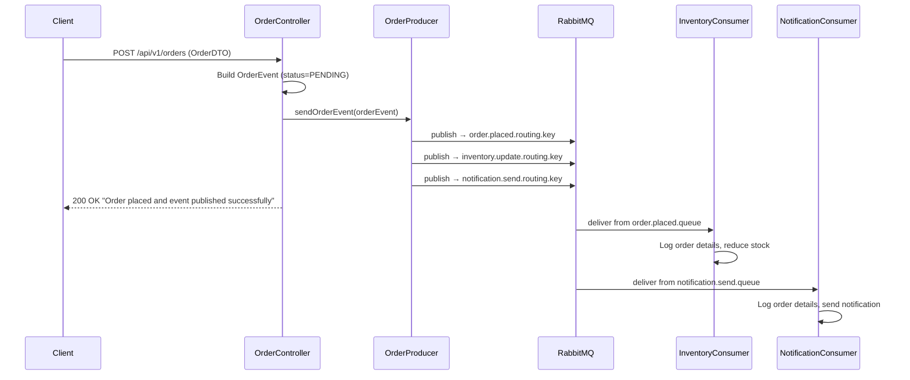
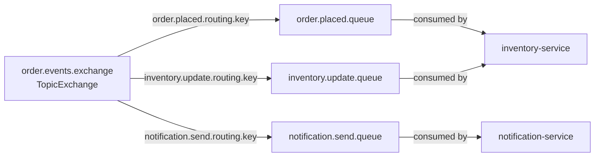

# Architecture & Flow — Event-Driven Microservices

A detailed guide to understand the design, message flow, and RabbitMQ topology of this project.

---

## Part 1 — RabbitMQ Core Concepts (Theory First)

Before looking at the code, understand these 4 building blocks. Every RabbitMQ integration is just a combination of these.

---

### 1. Queue

A **Queue** is a buffer that stores messages until a consumer picks them up.

- Messages sit in the queue in order (FIFO)
- A queue is **durable** (survives RabbitMQ restart) or **transient** (lost on restart)
- Only **one consumer** processes each message (point-to-point)

```
Producer → [  msg1  msg2  msg3  ] Queue → Consumer
```

**In Spring Boot:**
```java
@Bean
public Queue orderQueue() {
    return new Queue("order.placed.queue"); // durable by default
}
```

---

### 2. Exchange

A **Exchange** receives messages from producers and routes them to queues. The producer **never sends directly to a queue** — it always sends to an exchange.

There are 4 types:

| Type | How it routes |
|------|--------------|
| **Direct** | Exact match on routing key |
| **Topic** | Pattern match on routing key (`*` = one word, `#` = zero or more) |
| **Fanout** | Ignores routing key — sends to ALL bound queues |
| **Headers** | Routes by message headers, not routing key |

> This project uses **TopicExchange** — flexible and industry standard.

**In Spring Boot:**
```java
@Bean
public TopicExchange orderExchange() {
    return new TopicExchange("order.events.exchange");
}
```

---

### 3. Routing Key

A **Routing Key** is a string label the producer attaches to the message when sending to the exchange. The exchange uses it to decide which queue(s) get the message.

Think of it like a **postal code** — the exchange is the post office that reads it and decides where to deliver.

```
Producer → Exchange (reads routing key) → correct Queue
```

Examples used in this project:
```
order.placed.routing.key       → routes to order.placed.queue
inventory.update.routing.key   → routes to inventory.update.queue
notification.send.routing.key  → routes to notification.send.queue
```

---

### 4. Binding

A **Binding** is the link between an exchange and a queue. It says:
> "When a message with THIS routing key arrives at THIS exchange, send it to THIS queue."

Without a binding, the exchange doesn't know which queues exist.

```
Exchange ──[binding: routing key]──▶ Queue
```

**In Spring Boot:**
```java
@Bean
public Binding orderQueueBinding() {
    return BindingBuilder
        .bind(orderQueue())          // which queue
        .to(orderExchange())         // to which exchange
        .with(orderPlacedRoutingKey); // when routing key matches
}
```

---

### How It All Connects

```
                    ┌─────────────────────────────────┐
Producer            │         EXCHANGE                 │
sends message  ───▶ │   (reads the routing key)        │
with routing key    │                                  │
                    └──────┬──────────────┬────────────┘
                           │              │
                    [binding A]      [binding B]
                     routing key      routing key
                           │              │
                    ┌──────▼───┐   ┌──────▼──────┐
                    │  Queue A │   │   Queue B   │
                    └──────────┘   └─────────────┘
                         │                │
                    Consumer A       Consumer B
```

---

### Step-by-Step: How to Configure in Each Service

#### Step 1 — Define the Exchange (order-service only — producer declares it)
```java
@Bean
public TopicExchange orderExchange() {
    return new TopicExchange("order.events.exchange");
}
```

#### Step 2 — Define Queues (one per consumer service)
```java
@Bean
public Queue orderQueue() {
    return new Queue("order.placed.queue");
}

@Bean
public Queue inventoryQueue() {
    return new Queue("inventory.update.queue");
}

@Bean
public Queue notificationQueue() {
    return new Queue("notification.send.queue");
}
```

#### Step 3 — Bind Each Queue to the Exchange with a Routing Key
```java
@Bean
public Binding orderQueueBinding() {
    return BindingBuilder.bind(orderQueue())
        .to(orderExchange())
        .with("order.placed.routing.key");
}

@Bean
public Binding inventoryQueueBinding() {
    return BindingBuilder.bind(inventoryQueue())
        .to(orderExchange())
        .with("inventory.update.routing.key");
}

@Bean
public Binding notificationQueueBinding() {
    return BindingBuilder.bind(notificationQueue())
        .to(orderExchange())
        .with("notification.send.routing.key");
}
```

#### Step 4 — Configure Message Converter (JSON support)
```java
@Bean
public MessageConverter jacksonMessageConverter() {
    return new JacksonJsonMessageConverter(); // Java object ↔ JSON
}
```

#### Step 5 — Configure RabbitTemplate (producer only)
```java
@Bean
public AmqpTemplate amqpTemplate(ConnectionFactory connectionFactory) {
    RabbitTemplate rabbitTemplate = new RabbitTemplate(connectionFactory);
    rabbitTemplate.setMessageConverter(jacksonMessageConverter());
    return rabbitTemplate;
}
```

#### Step 6 — Force Declaration on Startup (producer only)
Without this, queues only appear in RabbitMQ after a consumer connects.
```java
@Bean
public RabbitAdmin rabbitAdmin(ConnectionFactory connectionFactory) {
    return new RabbitAdmin(connectionFactory);
}

@Bean
public ApplicationRunner rabbitInitializer(RabbitAdmin rabbitAdmin) {
    return args -> rabbitAdmin.initialize(); // declares all beans on startup
}
```

#### Step 7 — Publish a Message (producer)
```java
amqpTemplate.convertAndSend(exchangeName, routingKey, orderEvent);
// exchange routes the message to the correct queue based on routing key
```

#### Step 8 — Consume a Message (consumer service)
```java
@RabbitListener(queues = "${rabbitmq.queue.notification.name}")
public void consumeOrderEvent(OrderEvent orderEvent) {
    // Spring automatically deserializes the JSON back to OrderEvent object
}
```

---

### Consumer Service Configuration (Minimal)

Consumer services only need the **message converter** — they don't declare the exchange or bindings (the producer owns that):

```java
@Configuration
public class RabbitMQConfig {

    @Bean
    public MessageConverter jacksonMessageConverter() {
        return new JacksonJsonMessageConverter();
    }

    @Bean
    public SimpleRabbitListenerContainerFactory rabbitListenerContainerFactory(
            ConnectionFactory connectionFactory) {
        SimpleRabbitListenerContainerFactory factory = new SimpleRabbitListenerContainerFactory();
        factory.setConnectionFactory(connectionFactory);
        factory.setMessageConverter(jacksonMessageConverter());
        return factory;
    }
}
```

---


## Overview

When a client places an order, the **order-service** publishes an event to a RabbitMQ **TopicExchange**. The exchange routes the event to multiple queues based on routing keys. Each consumer service (inventory-service, notification-service) independently picks up the event from its own queue and processes it — with no knowledge of each other.

This is the **Publisher/Subscriber** pattern via a **Message Broker**.

---

## System Architecture

```
┌─────────────────────────────────────────────────────────────────────────┐
│                          CLIENT (Postman / Frontend)                     │
│                     POST /api/v1/orders  {orderId, name, qty, price}     │
└───────────────────────────────────┬─────────────────────────────────────┘
                                    │ HTTP
                                    ▼
┌───────────────────────────────────────────────────────────────────────────┐
│                         ORDER-SERVICE  (port 8081)                        │
│                                                                           │
│   OrderController  →  builds OrderEvent (status=PENDING)                 │
│          │                                                                │
│          ▼                                                                │
│   OrderProducer    →  publishes to RabbitMQ Exchange                     │
└───────────────────────────────┬───────────────────────────────────────────┘
                                │
                                ▼
┌───────────────────────────────────────────────────────────────────────────┐
│                  RABBITMQ  —  order.events.exchange (TopicExchange)        │
│                                                                           │
│   Routing Key: order.placed.routing.key   →  order.placed.queue          │
│   Routing Key: inventory.update.routing.key → inventory.update.queue     │
│   Routing Key: notification.send.routing.key → notification.send.queue   │
└────────────────────┬───────────────────────────┬──────────────────────────┘
                     │                           │
          ┌──────────▼──────────┐     ┌──────────▼──────────────┐
          │  INVENTORY-SERVICE  │     │  NOTIFICATION-SERVICE    │
          │    (port 8082)      │     │      (port 8083)         │
          │                     │     │                          │
          │  Listens to:        │     │  Listens to:             │
          │  order.placed.queue │     │  notification.send.queue │
          │                     │     │                          │
          │  → Reduces stock    │     │  → Sends confirmation    │
          └─────────────────────┘     └──────────────────────────┘
```

---

## Message Flow (Step by Step)



---

## RabbitMQ Topology



---

## OrderEvent Payload

This is the message published to RabbitMQ as JSON:

```json
{
  "status": "PENDING",
  "message": "Order placed successfully",
  "order": {
    "orderId": "ORD-001",
    "name": "iPhone 15",
    "quantity": 2,
    "price": 999.99
  }
}
```

> **Note:** The client only sends `order` fields. `status` and `message` are set by order-service internally.

---

## Service Responsibilities

### order-service (Producer)
| Component | Responsibility |
|-----------|---------------|
| `OrderController` | Receives HTTP request, validates input, builds `OrderEvent` |
| `OrderProducer` | Publishes `OrderEvent` to all 3 routing keys on the exchange |
| `RabbitMQConfig` | Declares exchange, queues, bindings, message converter, RabbitAdmin |
| `OrderDTO` | Input from client — validated with `@NotBlank`, `@Min`, `@Positive` |
| `OrderEvent` | Wrapper with `status`, `message`, and the `OrderDTO` |

### inventory-service (Consumer)
| Component | Responsibility |
|-----------|---------------|
| `InventoryConsumer` | Listens to `order.placed.queue`, logs and simulates stock reduction |
| `RabbitMQConfig` | Configures Jackson message converter for JSON deserialization |
| `OrderEvent` / `Order` | Local DTOs matching the published JSON structure |

### notification-service (Consumer)
| Component | Responsibility |
|-----------|---------------|
| `NotificationConsumer` | Listens to `notification.send.queue`, logs and simulates notification |
| `RabbitMQConfig` | Configures Jackson message converter for JSON deserialization |
| `OrderEvent` / `Order` | Local DTOs matching the published JSON structure |

---

## Package Structure

```
eventdrivenmicroservice/
│
├── order-service/
│   └── src/main/java/com/ms/orderservice/
│       ├── config/
│       │   └── RabbitMQConfig.java       ← Exchange, queues, bindings, RabbitAdmin
│       ├── controller/
│       │   └── OrderController.java      ← POST /api/v1/orders
│       ├── dto/
│       │   ├── OrderDTO.java             ← Client request body
│       │   └── OrderEvent.java           ← RabbitMQ message payload
│       └── publisher/
│           └── OrderProducer.java        ← Publishes to exchange
│
├── inventory-service/
│   └── src/main/java/com/ms/inventoryservice/
│       ├── config/
│       │   └── RabbitMQConfig.java       ← Jackson converter
│       ├── consumer/
│       │   └── InventoryConsumer.java    ← @RabbitListener
│       └── dto/
│           ├── Order.java
│           └── OrderEvent.java
│
└── notification-service/
    └── src/main/java/com/ms/notificationservice/
        ├── config/
        │   └── RabbitMQConfig.java       ← Jackson converter
        ├── consumer/
        │   └── NotificationConsumer.java ← @RabbitListener
        └── dto/
            ├── Order.java
            └── OrderEvent.java
```

---

## How to Run

### 1. Start RabbitMQ
```bash
docker run -d --name rabbitmq \
  -p 5672:5672 -p 15672:15672 \
  rabbitmq:management
```

### 2. Start Services (each in a separate terminal)
```bash
# Terminal 1
cd order-service && mvn spring-boot:run

# Terminal 2
cd inventory-service && mvn spring-boot:run

# Terminal 3
cd notification-service && mvn spring-boot:run
```

### 3. Place an Order
```
POST http://localhost:8081/api/v1/orders
Content-Type: application/json
```
```json
{
  "orderId": "ORD-001",
  "name": "iPhone 15",
  "quantity": 2,
  "price": 999.99
}
```

### 4. Expected Logs

**order-service:**
```
Publishing order event -> orderId: ORD-001, status: PENDING
Order event published to order, inventory and notification queues
```

**inventory-service:**
```
Inventory service received event from order.placed.queue
  Order ID  : ORD-001
  Item      : iPhone 15
  Quantity  : 2
  Price     : 999.99
Stock reduced successfully for orderId: ORD-001
```

**notification-service:**
```
Notification service received event from notification.send.queue
  Order ID  : ORD-001
  Item      : iPhone 15
  Quantity  : 2
  Price     : 999.99
Notification sent successfully for orderId: ORD-001
```

---

## Service Ports

| Service | Port |
|---------|------|
| order-service | 8081 |
| inventory-service | 8082 |
| notification-service | 8083 |
| RabbitMQ AMQP | 5672 |
| RabbitMQ Management UI | 15672 |

---

## Key Design Decisions

| Decision | Reason |
|----------|--------|
| `TopicExchange` over `DirectExchange` | Supports pattern-based routing keys — scalable for future queues |
| `AmqpTemplate` over `RabbitTemplate` | Interface-based — easier to test and swap implementations |
| `JacksonJsonMessageConverter` | Auto-serializes Java objects to JSON — no manual conversion needed |
| `RabbitAdmin` + `ApplicationRunner` | Forces queue/exchange declaration on startup without needing a consumer |
| Each service owns its own DTOs | Loose coupling — services don't share code or depend on each other |
| `@Valid` on controller input | Rejects bad requests before they reach RabbitMQ |

---

## Author

**Mohammad Mateen**

Full Stack Java Developer | Microservices Architect | AWS Certified Solutions Architect

📧 javamateen@gmail.com  
🔗 [GitHub](https://github.com/mateenms)
