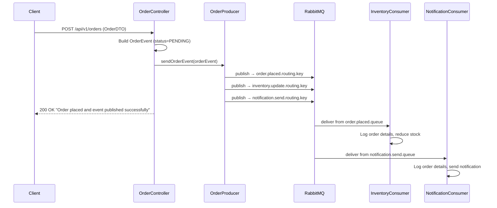
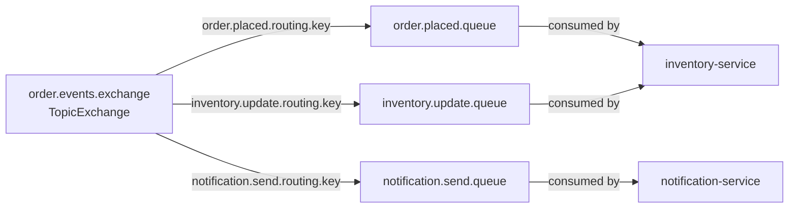

# Architecture & Flow — Event-Driven Microservices

A detailed guide to understand the design, message flow, and RabbitMQ topology of this project.

---

## Overview

When a client places an order, the **order-service** publishes an event to a RabbitMQ **TopicExchange**. The exchange routes the event to multiple queues based on routing keys. Each consumer service (inventory-service, notification-service) independently picks up the event from its own queue and processes it — with no knowledge of each other.

This is the **Publisher/Subscriber** pattern via a **Message Broker**.

---

## System Architecture

```
┌─────────────────────────────────────────────────────────────────────────┐
│                          CLIENT (Postman / Frontend)                     │
│                     POST /api/v1/orders  {orderId, name, qty, price}     │
└───────────────────────────────────┬─────────────────────────────────────┘
                                    │ HTTP
                                    ▼
┌───────────────────────────────────────────────────────────────────────────┐
│                         ORDER-SERVICE  (port 8081)                        │
│                                                                           │
│   OrderController  →  builds OrderEvent (status=PENDING)                 │
│          │                                                                │
│          ▼                                                                │
│   OrderProducer    →  publishes to RabbitMQ Exchange                     │
└───────────────────────────────┬───────────────────────────────────────────┘
                                │
                                ▼
┌───────────────────────────────────────────────────────────────────────────┐
│                  RABBITMQ  —  order.events.exchange (TopicExchange)        │
│                                                                           │
│   Routing Key: order.placed.routing.key   →  order.placed.queue          │
│   Routing Key: inventory.update.routing.key → inventory.update.queue     │
│   Routing Key: notification.send.routing.key → notification.send.queue   │
└────────────────────┬───────────────────────────┬──────────────────────────┘
                     │                           │
          ┌──────────▼──────────┐     ┌──────────▼──────────────┐
          │  INVENTORY-SERVICE  │     │  NOTIFICATION-SERVICE    │
          │    (port 8082)      │     │      (port 8083)         │
          │                     │     │                          │
          │  Listens to:        │     │  Listens to:             │
          │  order.placed.queue │     │  notification.send.queue │
          │                     │     │                          │
          │  → Reduces stock    │     │  → Sends confirmation    │
          └─────────────────────┘     └──────────────────────────┘
```

---

## Message Flow (Step by Step)



---

## RabbitMQ Topology



---

## OrderEvent Payload

This is the message published to RabbitMQ as JSON:

```json
{
  "status": "PENDING",
  "message": "Order placed successfully",
  "order": {
    "orderId": "ORD-001",
    "name": "iPhone 15",
    "quantity": 2,
    "price": 999.99
  }
}
```

> **Note:** The client only sends `order` fields. `status` and `message` are set by order-service internally.

---

## Service Responsibilities

### order-service (Producer)
| Component | Responsibility |
|-----------|---------------|
| `OrderController` | Receives HTTP request, validates input, builds `OrderEvent` |
| `OrderProducer` | Publishes `OrderEvent` to all 3 routing keys on the exchange |
| `RabbitMQConfig` | Declares exchange, queues, bindings, message converter, RabbitAdmin |
| `OrderDTO` | Input from client — validated with `@NotBlank`, `@Min`, `@Positive` |
| `OrderEvent` | Wrapper with `status`, `message`, and the `OrderDTO` |

### inventory-service (Consumer)
| Component | Responsibility |
|-----------|---------------|
| `InventoryConsumer` | Listens to `order.placed.queue`, logs and simulates stock reduction |
| `RabbitMQConfig` | Configures Jackson message converter for JSON deserialization |
| `OrderEvent` / `Order` | Local DTOs matching the published JSON structure |

### notification-service (Consumer)
| Component | Responsibility |
|-----------|---------------|
| `NotificationConsumer` | Listens to `notification.send.queue`, logs and simulates notification |
| `RabbitMQConfig` | Configures Jackson message converter for JSON deserialization |
| `OrderEvent` / `Order` | Local DTOs matching the published JSON structure |

---

## Package Structure

```
eventdrivenmicroservice/
│
├── order-service/
│   └── src/main/java/com/ms/orderservice/
│       ├── config/
│       │   └── RabbitMQConfig.java       ← Exchange, queues, bindings, RabbitAdmin
│       ├── controller/
│       │   └── OrderController.java      ← POST /api/v1/orders
│       ├── dto/
│       │   ├── OrderDTO.java             ← Client request body
│       │   └── OrderEvent.java           ← RabbitMQ message payload
│       └── publisher/
│           └── OrderProducer.java        ← Publishes to exchange
│
├── inventory-service/
│   └── src/main/java/com/ms/inventoryservice/
│       ├── config/
│       │   └── RabbitMQConfig.java       ← Jackson converter
│       ├── consumer/
│       │   └── InventoryConsumer.java    ← @RabbitListener
│       └── dto/
│           ├── Order.java
│           └── OrderEvent.java
│
└── notification-service/
    └── src/main/java/com/ms/notificationservice/
        ├── config/
        │   └── RabbitMQConfig.java       ← Jackson converter
        ├── consumer/
        │   └── NotificationConsumer.java ← @RabbitListener
        └── dto/
            ├── Order.java
            └── OrderEvent.java
```

---

## How to Run

### 1. Start RabbitMQ
```bash
docker run -d --name rabbitmq \
  -p 5672:5672 -p 15672:15672 \
  rabbitmq:management
```

### 2. Start Services (each in a separate terminal)
```bash
# Terminal 1
cd order-service && mvn spring-boot:run

# Terminal 2
cd inventory-service && mvn spring-boot:run

# Terminal 3
cd notification-service && mvn spring-boot:run
```

### 3. Place an Order
```
POST http://localhost:8081/api/v1/orders
Content-Type: application/json
```
```json
{
  "orderId": "ORD-001",
  "name": "iPhone 15",
  "quantity": 2,
  "price": 999.99
}
```

### 4. Expected Logs

**order-service:**
```
Publishing order event -> orderId: ORD-001, status: PENDING
Order event published to order, inventory and notification queues
```

**inventory-service:**
```
Inventory service received event from order.placed.queue
  Order ID  : ORD-001
  Item      : iPhone 15
  Quantity  : 2
  Price     : 999.99
Stock reduced successfully for orderId: ORD-001
```

**notification-service:**
```
Notification service received event from notification.send.queue
  Order ID  : ORD-001
  Item      : iPhone 15
  Quantity  : 2
  Price     : 999.99
Notification sent successfully for orderId: ORD-001
```

---

## Service Ports

| Service | Port |
|---------|------|
| order-service | 8081 |
| inventory-service | 8082 |
| notification-service | 8083 |
| RabbitMQ AMQP | 5672 |
| RabbitMQ Management UI | 15672 |

---

## Key Design Decisions

| Decision | Reason |
|----------|--------|
| `TopicExchange` over `DirectExchange` | Supports pattern-based routing keys — scalable for future queues |
| `AmqpTemplate` over `RabbitTemplate` | Interface-based — easier to test and swap implementations |
| `JacksonJsonMessageConverter` | Auto-serializes Java objects to JSON — no manual conversion needed |
| `RabbitAdmin` + `ApplicationRunner` | Forces queue/exchange declaration on startup without needing a consumer |
| Each service owns its own DTOs | Loose coupling — services don't share code or depend on each other |
| `@Valid` on controller input | Rejects bad requests before they reach RabbitMQ |

---

## Author

**Mohammad Mateen**

Full Stack Java Developer | Microservices Architect | AWS Certified Solutions Architect

📧 javamateen@gmail.com  
🔗 [GitHub](https://github.com/mateenms)
